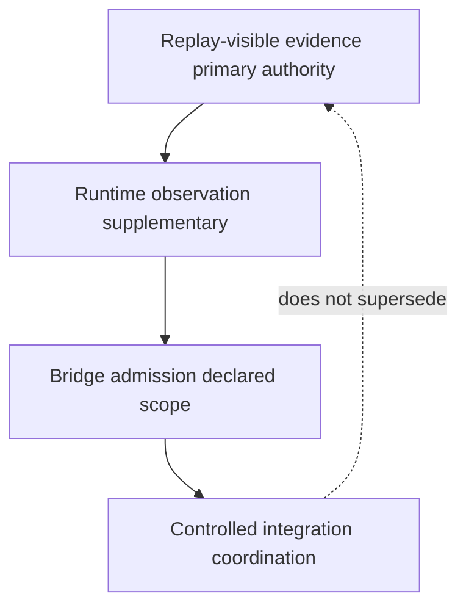

# Stage 4 — Future Extension Map

**Audience:** Researchers extending Stage 4 after the runtime governance freeze milestone.  
**Document type:** Architecture-oriented extension map. Documentation only; not an implementation, deployment, or operations specification.

**Branch posture:** `stage4-runtime-governance` exploratory snapshot.  
**Anchor milestone:** [[STAGE4_RUNTIME_GOVERNANCE_FREEZE]] · [[STAGE4_VALIDATION_SERIES_COMPLETION_NOTE]]

**Related:** [[STAGE4_EXTENSION_POLICY]] · [[STAGE4_BOUNDARY_CHANGE_POLICY]] · [[STAGE4_CROSS_STAGE_RELATIONSHIP_NOTE]] · [[STAGE4_DEFINED_VS_UNDEFINED_SURFACES]]

---

## Purpose

This map names **possible future extension paths** after the **Stage 4 runtime governance freeze** reading posture is established. It orients forward work without authorizing it, scheduling it, or implying that any path is selected, funded, or complete.

The freeze establishes a **canonical architectural reading snapshot** and a **stable reference point** for extensions. Extensions that follow must **preserve** bounded exploration, replay-visible primacy, governance-axis separation, and explicit non-claims ([[STAGE4_EXTENSION_POLICY]], [[STAGE4_SEMANTIC_INVARIANTS]]).

---

## Post-freeze posture at a glance

| Dimension | Frozen / pinned at milestone | Remains open |
|-----------|------------------------------|--------------|
| **Runtime governance reading** | Observer-aware layer, gate semantics, state/payload awareness, replay authority boundaries, non-collapse interpretation | New layers, contracts, and vocabulary under extension policy |
| **Validation chain (current series)** | P1 → P2 → campaign → P3 → P4 with citable `run_id`s | Additional validation families, campaigns, diff baselines |
| **Stage 3 authority** | Frozen offline validation reference | Boundary bumps on a **separate track** only |
| **Operational plane** | Not established | Deployment, merge, rollout, production sign-off |

---

## 1. Validation family extensions

The completed exploratory chain ([[STAGE4_VALIDATION_SERIES_COMPLETION_NOTE]]) exercises **mechanical inspection** on the Stage 4 primary substrate (`notes/04 VECTOR/`) with evidence under `validation_artifacts/stage4/`. Future validation work extends **families**, not a single “validation complete” verdict.

### 1.1 Core family lineage (completed baseline)

| Family | Role | Extension posture |
|--------|------|-------------------|
| **P1 — link integrity** | Wiki-link addressability and orphan inventory | Rerun on corpus increments; campaign pairing; disposition per [[STAGE4_VALIDATION_DISPOSITION_REFERENCE]] |
| **P2 — minimal graph** | Lineage navigability from pinned P1 | Truncation/provenance discipline; upstream pin requirements preserved |
| **Campaign** | Orchestrated P1→P2→continuity aggregation | Diff campaigns ([[STAGE4_CAMPAIGN_DIFFING_PLAN]]); explicit baseline/candidate/diff `run_id` triples |
| **P3 — manifest/evidence binding** | Cross-surface binding coherence within episode | New allowlists, scope pins, binding checker revisions — **not** replay proof |
| **P4 — replay authority non-collapse** | Handling-language hygiene on declared surfaces | Scope expansion only via explicit execution notes; never substrate for P1–P3 |

### 1.2 Plausible next families (not started as normative closure)

| Direction | Intent | Authority boundary |
|-----------|--------|-------------------|
| **Continuity / drift reports** | Classify divergence along named axes over campaign history | Informs review and limitations — not automatic verdict ([[STAGE4_DRIFT_MONITORING_CONTRACT]]) |
| **Scope / rerun sidecars** | Pin `validation_scope`, rerun pairs, execution metadata | Provenance discipline ([[STAGE4_RERUN_PROVENANCE_POLICY]]) — not governance closure |
| **Continuity graph checker (normative four-family shape)** | Episode-bounded lineage beyond minimal graph export | Aligns with [[STAGE4_CHECKER_EXECUTION_ORCHESTRATION_PLAN]] when implemented; does not replace P1/P2 |
| **Cross-campaign diff tooling** | Structural hygiene between pinned campaigns | [[STAGE4_CAMPAIGN_DIFFING_PLAN]] — improvement/degradation in docs, not replay equivalence |
| **Reconciliation / audit-chain fixtures** | Bounded experiment comparison across surfaces | Fixtures and protocols ([[STAGE4_RUNTIME_REPLAY_RECONCILIATION_FIXTURES]], [[STAGE4_GOVERNANCE_REPRODUCIBILITY_AUDIT_CHAINS]]) — separate from checker PASS semantics |

**Extension rule:** Each new family declares **substrate**, **upstream pins**, **output category**, **disposition vocabulary**, and **non-claims**. Families must not collapse into a unified PASS plane ([[STAGE4_P4_NON_COLLAPSE_IMPLEMENTATION_READINESS_GATE]]).

---

## 2. Runtime bridge integration possibilities

Runtime bridge work remains **planned vocabulary and bounded contracts**, not operational closure ([[STAGE3_RUNTIME_BRIDGE_PLANNING]], [[STAGE4_RUNTIME_BRIDGE_ADMISSION_CONTRACT]]).

### 2.1 Integration axes (forward-looking)

| Axis | Possible extension | What it does **not** imply |
|------|-------------------|------------------------------|
| **Admission contract depth** | Versioned bridge charters naming admissible runtime-origin classes | Replay equivalence or rewrite of replay semantics |
| **Observer-aware hooks** | Additive runtime observation alongside replay | Silent mutation of replay inputs or outcomes |
| **Chronicle ↔ bridge linkage** | Traceability from bridge decisions to chronicle episodes | Chronicle as replay proof |
| **Controlled integration** | Scoped coordination across gate, bridge, drift, review, chronicle | Single composite governance truth-source |
| **Stage 3 parity / harness** | Compare runtime-visible claims to pinned offline artifacts | Mutation of Stage 3 freeze results ([[STAGE4_CROSS_STAGE_RELATIONSHIP_NOTE]] § comparison without mutation) |

### 2.2 Bridge maturity ladder (conceptual)

Forward bridge work **strengthens eligibility and handling vocabulary** within declared scope. It does **not**, by default, relocate unbridged telemetry into the replay-evidence plane or override replay-visible proof.

---

## 3. Publication and review path

“Publication” here means **documentation and evidence visibility** on the exploratory branch—not product release, merge authorization, or deployment sign-off.

### 3.1 Documentation publication extensions

| Path | Content | Guardrails |
|------|---------|------------|
| **Corpus integration** | Index updates ([[STAGE4_DOCUMENT_INDEX]], [[STAGE4_DOCUMENTATION_INDEX]]), cross-reference maps, reading guides | New docs must satisfy [[STAGE4_EXTENSION_POLICY]] authority/scope/non-claims blocks |
| **README / evolution index** | Milestone pointers for external readers | Milestone ≠ operational authorization |
| **Artifact tracking memos** | Pin subset of `validation_artifacts/stage4/` for citable chains | Untracked runs remain documented, not mandatory `git add` |
| **Branch comparison narratives** | Diff reports, campaign comparisons, disposition summaries | Cite path + `run_id`; label exploratory plane vs. Stage 3 freeze plane |

### 3.2 Review path (candidacy — hypothetical)

If review is undertaken in the future, procedure is specified in [[STAGE4_CANDIDATE_REVIEW_FLOW]] under [[STAGE4_MINIMAL_CANDIDATE_CRITERIA]] and [[STAGE4_REVIEW_STATE_MODEL]]:

| Stage | Function |
|-------|----------|
| **Evidence gate** | Replay-visible material and declared artifacts before substantive review |
| **Disagreement classification** | Typed divergence preserved — no narrative reconciliation |
| **Conformance workflow** | Alignment checks without collapsing axes |
| **Review states** | `reviewable`, `held`, `excluded` — posture only, not replay outcomes |
| **Bounded promotion** | Governance-language progression — not deployment ([[STAGE4_BOUNDED_PROMOTION_SEMANTICS]]) |

The runtime governance freeze **does not** open, complete, or substitute for this review path. Review remains a **separate, evidence-gated** procedure *if* candidacy thresholds are met on their own pins.

---

## 4. Boundary governance and Stage 3 relationship

### 4.1 Stage relationship (fixed by freeze)

| Rule | Meaning |
|------|---------|
| **Stage 3 frozen reference** | Pinned offline validation, deterministic replay on declared pins, archived evidence |
| **Stage 4 separate plane** | Runtime governance semantics and branch-local mechanical validation |
| **No supersession** | Stage 4 freeze reading posture does not inherit, amend, or replace Stage 3 freeze authority |
| **Replay discipline inheritance** | Methodological — not transfer of freeze status |

Authority ordering: **replay-visible evidence** remains primary for trace-grounded questions; Stage 4 surfaces **inform, qualify, or block** within declared scope only ([[STAGE4_CROSS_STAGE_RELATIONSHIP_NOTE]]).

### 4.2 Boundary governance tools for extensions

| Mechanism | Use when extending |
|-----------|-------------------|
| [[STAGE4_BOUNDARY_CHANGE_POLICY]] | Scope widening, replay-authority reinterpretation, axis expansion, bridge-authority widening, lifecycle reinterpretation |
| [[STAGE4_EXTENSION_POLICY]] | Reject implicit deployment, replay-equivalence inflation, truth-source collapse |
| [[STAGE3_POST_FREEZE_TRANSITION_PLAN]] | Stage 3 **boundary bump** — new pins, matrix rows, validator meaning — on a **separate track** |
| [[STAGE4_DEFINED_VS_UNDEFINED_SURFACES]] | Distinguish defined semantics from intentionally open surfaces |

**Practical rule:** Compare Stage 3 artifacts **read-only**. Label exploratory divergence. Branch before widening the pinned validation surface.

### 4.3 What the freeze preserves for cross-stage work

- Stage 3 remains the citation anchor for **implementation-validation reference** claims.
- Stage 4 remains the citation anchor for **runtime governance exploration** and **mechanical validation** claims (with `run_id`).
- Cross-stage prose must use **explicit plane labels** ([[STAGE4_STAGE_BOUNDARY_REFERENCE]]).

---

## 5. Future work preserved after the freeze milestone

The freeze **closes the reading posture**, not exploration. The following remain legitimate forward work without contradicting the milestone:

| Preserved work area | Notes |
|---------------------|-------|
| **Additional validation families** | Drift, diff tooling, graph checker maturity, scope sidecars — each with own evidence plane |
| **Bridge and integration depth** | Contracts, admission rules, controlled integration scenarios — architecture first |
| **Candidacy and review preparation** | Artifact map, minimal criteria, review flow — attainment not asserted |
| **Cryptographic authenticity** | Separate pins and evidence when dispositive — not closed by corpus coherence |
| **Implementation validation on pins** | Bridge, monitor, chronicle, parity harness — requires replay-grounded evidence outside semantics-only docs |
| **Stage 4 freeze decision (distinct)** | Explicit tag, pin line, regression baseline — **not** implied by runtime governance freeze note |
| **Stage 3 boundary bumps** | Documented separate track when offline validation surface must widen |
| **Operational authorization plane** | Production fitness, rollout, organizational sign-off — outside both stages’ exploratory scope |
| **Corpus evolution** | New layers under extension policy; index and cross-reference maintenance |

**Intentionally undefined** surfaces ([[STAGE4_DEFINED_VS_UNDEFINED_SURFACES]]) remain guards against premature closure — absence of specification is discipline, not backlog to be papered over.

---

## 6. Extension selection discipline

Before pursuing any path above:

1. State **which governance question** the extension answers.
2. Declare **authority**, **scope**, and **non-claims** for new material.
3. Confirm **no governance-axis collapse** and **no silent Stage 3 widening**.
4. Plan **evidence**: path + `run_id` for mechanical claims; Stage 3 pins for validation-reference claims.
5. Record **boundary change** when scope or authority moves ([[STAGE4_BOUNDARY_CHANGE_POLICY]]).

Unacceptable patterns remain excluded regardless of milestone timing ([[STAGE4_EXTENSION_POLICY]] § Unacceptable Extension Patterns).

---

## Explicit non-claims

This map **does not**:

| Non-claim | Meaning |
|-----------|---------|
| **Authorize any extension** | Paths are architectural possibilities, not approvals or commitments |
| **Imply production readiness** | Freeze and validation chain do not establish fielding fitness |
| **Grant deployment or merge sign-off** | Operational plane remains separate |
| **Close governance semantics** | Runtime governance vocabulary may still evolve on declared increments |
| **Supersede Stage 3** | Frozen validation reference and replay-visible authority on pins unchanged |
| **Declare Stage 4 tag freeze** | Runtime governance freeze ≠ Stage 4 pin/regression freeze |
| **Assert implementation completeness** | Named mechanisms may remain documentation-only until separately evidenced |
| **Require any listed path** | No path is mandatory; tracking memos document options, not obligations |

---

## Summary

After [[STAGE4_RUNTIME_GOVERNANCE_FREEZE]], Stage 4 forward work proceeds along **distinct extension paths**: validation families atop the completed P1–P4 chain, bounded runtime bridge and controlled integration depth, documentation/publication and **hypothetical** candidacy review, and **explicit** boundary governance that keeps Stage 3 frozen authority intact. The freeze **preserves** exploratory latitude while **pinning** reading posture — extensions strengthen structure and evidence discipline; they do not, by default, convert exploration into operational authorization or replay proof.

---

*End of Stage 4 future extension map.*
