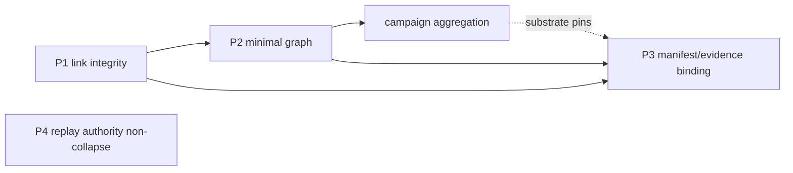

# Stage 4 — Validation Series Completion Note

**Audience:** Researchers and operators on branch `stage4-runtime-governance` assessing the **exploratory runtime-governance validation chain** (mechanical checkers → archived JSON → operator reading).  
**Document type:** Series completion summary. Documentation only; no checker edits, artifact moves, or git actions.

**Branch:** `stage4-runtime-governance`  
**Series posture:** Exploratory validation evidence chain — not freeze, not governance closure, not production sign-off.  
**Related:** [[STAGE4_STAGE_BOUNDARY_REFERENCE]] · [[STAGE4_VALIDATION_ARTIFACT_INTERPRETATION_RULES]] · [[STAGE4_VALIDATION_ARTIFACT_LAYOUT_PLAN]] · [[STAGE4_DOCUMENTATION_INDEX]] · [[STAGE4_VALIDATION_ARTIFACT_TRACKING_NOTE_2026-05-25]] (tracking supplement `1d390a2`)

---

## Purpose

This note records completion of the **current Stage 4 validation series** as a **bounded, citable exploratory chain**: defined mechanical inspections on the Stage 4 primary surface (`notes/04 VECTOR/`), with outputs under `validation_artifacts/stage4/`, read under explicit Stage 3/4 authority separation.

It summarizes **which validation surfaces have been exercised and archived** at this milestone. Normative reading rules remain in the validation documentation set ([[STAGE4_DOCUMENTATION_INDEX]]); this note does not restate checker specs or introduce new run metrics.

---

## Stage 4 validation scope

| Dimension | Boundary |
|-----------|------------|
| **Primary substrate** | `notes/04 VECTOR/*.md` — wiki-link addressability, minimal graph substrate, allowlisted manifest/evidence doc-citations, replay-authority handling-language hygiene on declared surfaces |
| **Evidence plane** | `validation_artifacts/stage4/` — category layout per [[STAGE4_VALIDATION_ARTIFACT_LAYOUT_PLAN]] |
| **Execution model** | Hand-run and campaign-orchestrated checkers under [[STAGE4_VALIDATION_CAMPAIGN_EXECUTION_SEQUENCE]]; P3 and P4 as **separate** steps after substrate exists |
| **Authority** | Mechanical observation on an **exploratory branch** — informs research and operator disposition; does not amend Stage 3 pins or runtime fielding posture |

**Chain shape (conceptual):**

P4 inspects handling-language hygiene on the allowlisted primary surface; it is **not** a substitute for P1–P3 substrate or trace-level replay proof.

---

## Relationship to Stage 3 freeze and deterministic replay

Stage 3 remains the **frozen implementation-validation reference**: pinned offline fixtures, deterministic PASS/FAIL on declared pins, and replay-visible authority ([[STAGE3_FREEZE_HANDOFF_NOTE]], [[STAGE3_FREEZE_COMPLETION_NOTE]], [[STAGE4_STAGE_BOUNDARY_REFERENCE]]).

| Stage | Question | This series answers? |
|-------|----------|---------------------|
| **Stage 3** | On declared pins, does offline validation replay deterministically with recorded taxonomy? | **No** — Stage 4 validation does not re-execute Stage 3 traces or inherit freeze status |
| **Stage 4** | On this branch substrate, what did defined mechanical checks observe? | **Yes** — within declared scope and pinned `run_id`s only |

Stage 4 validation **inherits replay discipline as reading posture** (cite pins, do not collapse governance axes) but **does not** widen the Stage 3 matrix, supersede freeze archives, or transfer Stage 3 PASS semantics to corpus-clean mechanical runs.

---

## Completed validation surfaces

The following surfaces have **executable runs and archived evidence** on `stage4-runtime-governance` at this milestone. Cite **path + `run_id`** for any claim; representative pinned runs are listed — not an exhaustive inventory of every historical file.

| Surface | Role | Representative evidence / note |
|---------|------|--------------------------------|
| **P1 — link integrity** | Wiki-link resolution and orphan inventory on scanned markdown | Tracked: `validation_reports/link_integrity_20260520T022722Z.json` (campaign-aligned); see [[STAGE4_VALIDATION_CAMPAIGN_RESULT_2026-05-20]] (`campaign_run_id` `20260520T022722Z`) |
| **P2 — graph extraction / provenance** | Minimal graph from pinned P1; truncation and upstream provenance in export | Tracked: `graph_exports/minimal_graph_20260520T022722Z.json`; control run narrative in [[STAGE4_GRAPH_EXTRACTION_CONTROL_RESULT_2026-05-19]] |
| **Campaign evidence** | Orchestrated P1→P2→continuity pass with linked `campaign_reports/` | Tracked: `campaign_reports/stage4_campaign_20260520T022722Z.json`; diff example: `diff_reports/stage4_campaign_diff_20260520T132359Z.json` |
| **P3 — manifest/evidence binding coherence** | Allowlisted doc-citation and field observability given pinned P1/P2 | Tracked: `binding_reports/manifest_evidence_20260522T062013Z.json`; policy pin [[STAGE4_P3_V0_EXECUTION_NOTE_2026-05-22]] |
| **P4 — replay authority non-collapse** | Authority-escalation / handling-language hygiene enumeration on allowlisted Stage 4 primary surface | Tracked: `validation_reports/replay_authority_non_collapse_20260525T122754Z.json` (`checker_run_id` `20260525T122754Z`); indexed in commit `5c26ea5` |

**Commits (artifact / tracking posture only):**

| Commit | Content |
|--------|---------|
| `5c26ea5` | Add Stage 4 P4 replay authority non-collapse validation artifact |
| `baa52b4` | Update Stage 4 validation artifact tracking for P4 report |

Continuity anomaly and graph-continuity reports exist under `anomaly_reports/` and `continuity_reports/` as campaign substrates; disposition follows [[STAGE4_VALIDATION_DISPOSITION_REFERENCE]] when citing those families.

---

## Tracked artifact inventory summary

As of the tracking snapshot in [[STAGE4_VALIDATION_ARTIFACT_TRACKING_NOTE_2026-05-25]], the **pinned subset** cited by this series completion includes:

| Category | Tracked count (subset) | Examples |
|----------|------------------------|----------|
| `validation_reports/` | 3× link integrity + 1× P4 non-collapse | `link_integrity_20260520T022722Z.json`; `replay_authority_non_collapse_20260525T122754Z.json` |
| `binding_reports/` | 1× P3 binding | `manifest_evidence_20260522T062013Z.json` |

**Additional tracked categories** (full branch index; out of scope for the tracking memo’s five-file subset but part of the exploratory chain): `graph_exports/`, `campaign_reports/`, `anomaly_reports/`, `continuity_reports/`, `diff_reports/`. Use `git ls-files validation_artifacts/stage4/` on `stage4-runtime-governance` for the authoritative index list.

Git tracking records **repository-pinned exploratory evidence** on the branch; it does not mean “latest,” “passed,” or “authoritative for all claims.”

---

## Interpretation boundaries

| Boundary | Rule |
|----------|------|
| **Exploratory evidence only** | Artifacts record what a defined check observed on a declared substrate at run time — not governance truth or semantic closure |
| **No deployment verdict** | No merge, release, rollout, or operational-hardening authorization |
| **No pass/fail production claim** | Non-empty buckets, campaign `complete`, and exit code `0` are **not** production PASS; P4 `disposition_notice` / `non_collapse_notice` govern P4 reading |
| **Explicit `run_id` citation required** | Every disposition or cross-note claim must cite full repo path + `run_id` per [[STAGE4_VALIDATION_ARTIFACT_INTERPRETATION_RULES]] and [[STAGE4_RERUN_PROVENANCE_POLICY]] |
| **No Stage 3 freeze inheritance** | Stage 4 JSON does not extend or supersede Stage 3 freeze archives without [[STAGE4_BOUNDARY_CHANGE_POLICY]] |
| **No new results in this note** | Counts, severities, and bucket sizes live in archived JSON and dated result notes — not re-derived here |

---

## Untracked and intermediate artifacts

Intermediate or local-only runs (additional P3 binding reports, a later P1 link-integrity report) are **documented** in [[STAGE4_VALIDATION_ARTIFACT_TRACKING_NOTE_2026-05-25]]: classification, retention posture, and explicit non-claims. Untracked status is **git index posture**, not a quality verdict.

---

## Explicit non-claims

| Non-claim | Meaning |
|-----------|---------|
| **Stage 4 freeze** | Series completion does not declare a freeze tag, pin line, or regression baseline |
| **Governance closure** | Mechanical validation does not close runtime governance semantics or gate policy |
| **Stage 3 alignment** | Clean Stage 4 runs do not imply Stage 3 PASS or replay proof on pins |
| **Implementation complete** | Checker and campaign tooling may evolve; this note closes the **current validation chain milestone**, not all future families |
| **Documentation series closure** | Interpretation architecture is indexed at [[STAGE4_DOCUMENTATION_INDEX]] — separate from this execution-chain completion |

---

## 2026-05-26 supplement — Runtime replay consistency

**Posture:** Bounded exploratory supplement — **additive** to this completion note. The P1→P4 validation series completion claims in **Completed validation surfaces** above are **unchanged**; this subsection records a separate hand-run artifact pair indexed after the original series milestone.

| Dimension | Boundary |
|-----------|------------|
| **Scope** | Guard Runtime Chronicle MVP — hand-run input chronicle and consistency report only |
| **Evidence plane** | `validation_artifacts/stage4/runtime_replay_inputs/` · `validation_artifacts/stage4/runtime_replay_reports/` |
| **Authority** | Exploratory runtime-replay consistency observation on `stage4-runtime-governance`; does not extend P1–P4 checker coverage or completion semantics |

**Artifacts (cite path + report fields; not an exhaustive branch index):**

| Role | Path |
|------|------|
| **Input** | `validation_artifacts/stage4/runtime_replay_inputs/runtime_chronicle_mvp_20260526.jsonl` |
| **Report** | `validation_artifacts/stage4/runtime_replay_reports/runtime_replay_consistency_20260526_mvp.json` |

**Commits (artifact / tracking posture only):**

| Commit | Content |
|--------|---------|
| `a69cd4b` | Index runtime replay consistency MVP input and report artifacts |
| `1d390a2` | Update [[STAGE4_VALIDATION_ARTIFACT_TRACKING_NOTE_2026-05-25]] for supplement rows |

**Observation summary** (MVP hand-run report `runtime_replay_consistency_20260526_mvp.json`; positive fields are **not** pass/fail or deployment signals):

| Field | Value |
|-------|-------|
| `reconciliation_posture` | `reconciled` |
| `consistent` | `true` |
| `bridge_eligible` | `true` (for this chronicle path only, per report JSON) |

Inventory detail and supplement reading posture: [[STAGE4_VALIDATION_ARTIFACT_TRACKING_NOTE_2026-05-25]] § Runtime replay consistency — Guard Runtime Chronicle MVP (`20260526`).

**Supplement non-claims:**

| Non-claim | Meaning |
|-----------|---------|
| **Production readiness** | `consistent: true` and `reconciliation_posture: reconciled` are not deployment approval or operational hardening |
| **Stage 3 replay authority supersession** | Does not inherit, override, or supersede Stage 3 replay-validation freeze authority |
| **Full runtime replay bridge completion** | MVP hand-run scope only; full `runtime_replay_bridge` implementation and coverage remain separate work |
| **P1→P4 series extension** | Does not amend, widen, or re-open P1–P4 completion claims in this note |

*Note:* Commit `a69cd4b` also indexed `validation_artifacts/stage4/runtime_replay_inputs/guard_base_unused.jsonl` — **out of scope** for this supplement; cite only when explicitly needed.

---

## Next step

**Stage 4 runtime governance freeze note** — a follow-on note that may bound exploratory branch posture (documentation and evidence pins) without conflating it with Stage 3 freeze authority or deployment authorization. Until that note exists, treat this completion as **validation-chain archival posture only**.

---

## Summary

| Dimension | This completion |
|-----------|-----------------|
| **What completed** | Exploratory P1 → P2 → campaign → P3 → P4 validation chain with citable archived evidence on `stage4-runtime-governance` |
| **Stage 3 relation** | Separate authority plane; deterministic replay reference unchanged |
| **Pinned P4 artifact** | `replay_authority_non_collapse_20260525T122754Z.json` (`5c26ea5`; tracking update `baa52b4`) |
| **2026-05-26 supplement** | Runtime replay consistency MVP pair (`a69cd4b`; tracking `1d390a2`) — **outside** P1→P4 completion subset; see supplement section |
| **Inventory detail** | [[STAGE4_VALIDATION_ARTIFACT_TRACKING_NOTE_2026-05-25]] |
| **What it is not** | Freeze, deployment verdict, production PASS, or Stage 3 replay proof |
| **Next** | Stage 4 runtime governance freeze note |

---

*End of Stage 4 validation series completion note.*
