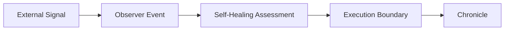
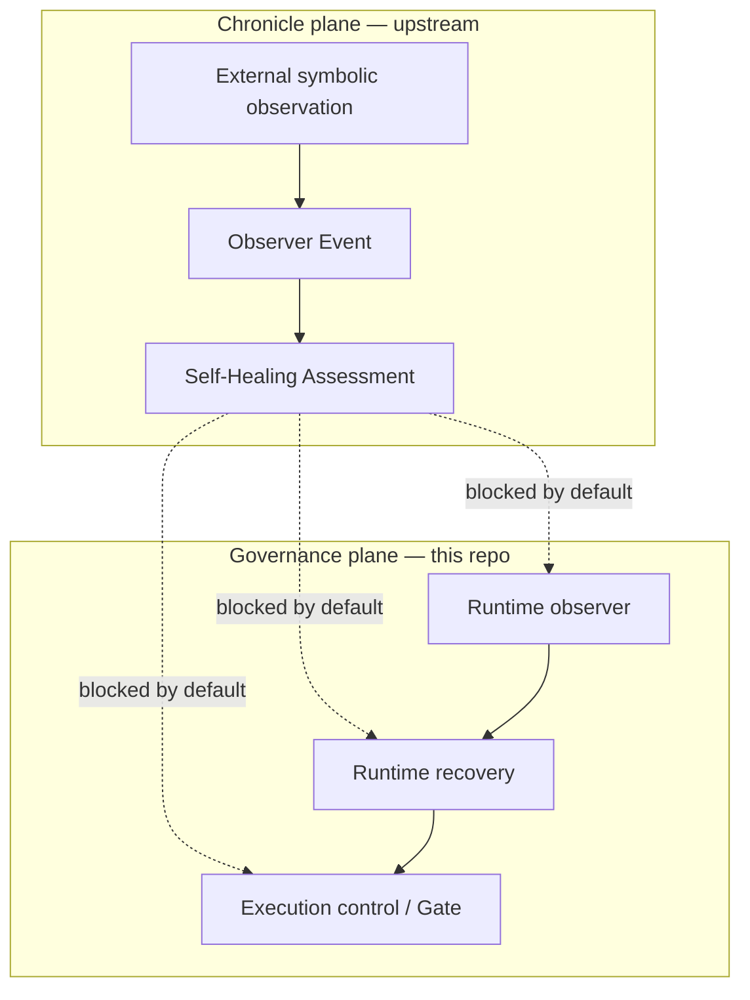

# Stage 5-B — External Signal Observer Architecture

**Audience:** Researchers extending VECTOR governance after the Stage 4 runtime governance freeze milestone.  
**Document type:** Architecture coordination note. Documentation only; not an implementation, deployment, or operations specification.

**Branch posture:** `stage4-runtime-governance` exploratory snapshot.  
**Anchor milestone:** [[STAGE4_RUNTIME_GOVERNANCE_FREEZE]] · [[STAGE4_FUTURE_EXTENSION_MAP]]

**Upstream observation authority:** [vector-signal-chronicle](https://github.com/chrono-vector/vector-signal-chronicle)

**Related:** [[STAGE4_CLOSURE_NOTE]] · [[STAGE4_STAGE_BOUNDARY_REFERENCE]]

---

## 1. Purpose

This note defines the **Stage 5-B architectural posture** for relating **external symbolic signal observation** to **VECTOR runtime governance** without modifying runtime behavior, schemas, or execution paths.

Stage 5-B answers a distinct governance question from Stage 4:

| Stage | Question |
|-------|----------|
| **Stage 4** | How does **internal** observer-aware runtime governance interpret trusted vs observed state under declared authority boundaries? |
| **Stage 5-B** | How may **external** symbolic observations be recorded, assessed, and bounded so they do **not** silently influence runtime execution? |

This note is a **bridge-layer vocabulary and plane-separation document**. It coordinates terminology between the chronicle repository (observation authority) and this repository (execution-governance authority). It does **not** authorize implementation, ingestion, bridge activation, or runtime wiring.

---

## 2. Relationship to vector-signal-chronicle

[vector-signal-chronicle](https://github.com/chrono-vector/vector-signal-chronicle) is the **upstream observation repository** for external symbolic signals. Its purpose is observation, organization, and study — not proof, prediction, or validation of external claims.

| Responsibility | vector-signal-chronicle | This repository (VECTOR runtime governance) |
|----------------|-------------------------|-----------------------------------------------|
| **Primary plane** | External symbolic observation | Internal runtime observer-aware governance |
| **Permanent record** | Chronicle episodes (Markdown) | Guard chronicle JSONL (runtime governance episodes) |
| **Default posture** | Record; assess; monitor; do not execute | Evaluate governance path; gate decisions under harness |
| **Truth posture** | No truth claims; human judgment authoritative | Scenario-bounded research evidence; explicit non-claims |
| **Execution** | Execution Boundary blocks symbolic → execution | Gate (ALLOW / THROTTLE / BLOCK); governance path only |

**Authority separation:**

- Chronicle repo **owns** external signal bodies, Observer Events, Self-Healing Assessments, and Execution Boundary decisions for symbolic inputs.
- This repo **owns** runtime governance semantics frozen at [[STAGE4_RUNTIME_GOVERNANCE_FREEZE]] and does not supersede chronicle observation authority.
- VECTOR should **consume observations** from the chronicle plane; VECTOR must **never consume assumptions as facts** ([chronicle OBSERVER_GUIDELINES.md](https://github.com/chrono-vector/vector-signal-chronicle/blob/main/OBSERVER_GUIDELINES.md)).

**Key chronicle documents (by reference):**

| Document | Role |
|----------|------|
| [OBSERVER_GUIDELINES.md](https://github.com/chrono-vector/vector-signal-chronicle/blob/main/OBSERVER_GUIDELINES.md) | Observation vs interpretation discipline; human judgment; no truth claims |
| [SIGNAL_INDEX.md](https://github.com/chrono-vector/vector-signal-chronicle/blob/main/SIGNAL_INDEX.md) | Index of recorded signals and processing status |
| [signal_integration_plan.md](https://github.com/chrono-vector/vector-signal-chronicle/blob/main/signal_integration_plan.md) | Phased integration architecture (manual → structured → event → scoring) |
| [execution_boundary.md](https://github.com/chrono-vector/vector-signal-chronicle/blob/main/execution_boundary.md) | Named decision point: symbolic observation must not directly trigger execution |

Stage 5-B does **not** duplicate chronicle signal bodies. It names how chronicle outputs may be **read** by governance researchers without collapsing observation authority into runtime authority.

---

## 3. Processing chain

The chronicle repository defines a five-step processing chain for external symbolic signals. Stage 5-B adopts this chain as the **canonical reading order** for external-signal governance posture:

| Step | Function | Governance posture |
|------|----------|-------------------|
| **External Signal** | Raw symbolic observation from an external source (social post, narrative burst, motif sequence) | Record what was observed; separate observation from interpretation |
| **Observer Event** | Structured chronicle artifact naming the observation, source, event type, and recommended handling | Chronicle-plane input; **must not** directly modify runtime state |
| **Self-Healing Assessment** | Review step asking whether runtime, recovery, or execution control should change | Default: **no change**; requires verified runtime evidence to recommend action |
| **Execution Boundary** | Named gate between assessment conclusions and any execution influence | External signal alone is insufficient to cross; human approval required for any execution consideration |
| **Chronicle** | Permanent, append-oriented observation record | Original observation is never rewritten; analysis may evolve |

**Direction of influence:**

- Chronicle → assessment → boundary decision is **permitted** (observation flows inward for review).
- External symbolic signal → runtime state / recovery / execution control is **blocked by default** and requires the full boundary checklist (see §7).

This chain is **orthogonal** to the Stage 4 runtime flow (Request → Observer State → Risk Model → Gate → Chronicle Logs). The two flows meet only at explicitly declared bridge points — not by collapsing external narrative into `observer_gap`.

---

## 4. Plane separation

Stage 5-B preserves **four distinct planes**. Collapsing any pair is an unacceptable extension pattern ([[STAGE4_EXTENSION_POLICY]] posture inherited by reference).

### 4.1 External symbolic observation

- **Scope:** Third-party narratives, symbolic motifs, burst posting patterns, and other externally sourced material recorded in vector-signal-chronicle.
- **Authority:** Chronicle repository; human judgment authoritative.
- **Outputs:** Observer Events, chronicle Markdown, SIGNAL_INDEX entries.
- **Does not:** Assert factual correctness, predict outcomes, or modify runtime parameters.

### 4.2 Runtime observer

- **Scope:** Internal observer-aware governance — `observer_gap`, `observer_distrust`, `p_fail`, confidence, estimation drift — as exercised in Stage 4 harness scenarios.
- **Authority:** This repository's runtime governance prototype and frozen reading posture ([[STAGE4_RUNTIME_GOVERNANCE_FREEZE]]).
- **Outputs:** Gate decisions (ALLOW / THROTTLE / BLOCK), Guard chronicle JSONL episodes, evaluation CSVs.
- **Does not:** Ingest external symbolic narratives as observer truth; treat chronicle interpretation as verified runtime evidence.

### 4.3 Recovery / self-healing

Two **non-equivalent** recovery concepts coexist:

| Concept | Plane | Default posture |
|---------|-------|-----------------|
| **Runtime recovery** | Internal runtime observer | Distrust and `p_fail` decay after sustained clean `observer_gap` observations in harness scenarios |
| **Self-Healing Assessment** | Chronicle / governance review | "Should runtime change?" for external events; default **recovery not required** |

Self-Healing Assessment is a **governance review artifact**, not the runtime recovery loop. External narratives must never directly trigger runtime recovery behavior.

### 4.4 Execution control

- **Scope:** Any action that would change runtime state, invoke recovery, or activate execution control beyond chronicle recording.
- **Authority:** Human approval required; automated execution from symbolic external signals alone is prohibited ([chronicle execution_boundary.md](https://github.com/chrono-vector/vector-signal-chronicle/blob/main/execution_boundary.md)).
- **Stage 4 analog:** Gate escalation and governance-path evaluation — bounded to internal signals in current harness scope.
- **Bridge status (default):** Execution Control Bridge **not activated** for external symbolic inputs.

Solid arrows are permitted data flow within a plane. Dotted arrows require explicit boundary crossing (§7 default: not crossed).

---

## 5. Mapping table — chronicle concepts ↔ Stage 4 governance concepts

| Chronicle concept | Stage 4 / runtime governance analog | Relationship |
|-------------------|-------------------------------------|--------------|
| **External Signal** | *(no direct analog)* | New upstream input class; not `observer_gap` or payload |
| **Observer Event** | Guard chronicle episode | Both are durable records; **different authority planes** — Observer Event is external/chronicle-origin; Guard chronicle is runtime-governance-origin |
| **Self-Healing Assessment** | Recovery evaluation scripts (`evaluate_recovery_latency.py`, etc.) | **Not equivalent** — assessment reviews external-event influence; runtime recovery decays distrust from verified internal divergence |
| **Execution Boundary** | Replay authority boundary + bridge admission + evidence gate ([[STAGE4_FUTURE_EXTENSION_MAP]] §2) | **Composes** existing boundaries for the external-signal path; does not replace them |
| **Chronicle (chronicle repo)** | Chronicle Logs / Guard JSONL | Both permanent records; chronicle repo owns external observations; Guard chronicle owns runtime governance episodes |
| **Observation / Interpretation split** | Non-collapse interpretation boundaries ([[STAGE4_RUNTIME_GOVERNANCE_FREEZE]]) | Shared discipline; applied to external signals upstream and internal signals downstream |
| **Human judgment authoritative** | Explicit non-claims; scenario-bounded evidence | Shared posture; chronicle applies to external narrative; Stage 4 applies to harness claims |
| **Confidence level (High/Medium/Low)** | `confidence` scalar in risk model | **Not equivalent** — chronicle confidence is interpretation confidence, not runtime observation confidence |
| **Descriptive scoring (RUN CMD, Portal, etc.)** | Risk model features / `p_fail` inputs | **Not equivalent** — descriptive motif scoring must not feed `p_fail` without separate boundary change |
| **Execution Control Bridge** | Runtime bridge / controlled integration ([[STAGE4_FUTURE_EXTENSION_MAP]] §2.1) | Forward-looking coordination vocabulary; **not activated** by default |
| **"No runtime action" status** | Governance path only; no action execution | Aligned default posture |

**Collapse warnings (explicit):**

- Observer Event ≠ `observer_gap` trajectory input.
- Self-Healing Assessment ≠ runtime recovery loop.
- Chronicle update ≠ gate escalation.
- External symbolic coherence ≠ verified runtime evidence.

---

## 6. Worked example — White Rabbit Cascade 2026-07-02 (reference only)

The chronicle repository's first complete external signal processing example is cited **by reference only**. Signal bodies remain in vector-signal-chronicle; this note does not reproduce observation content.

| Field | Value |
|-------|-------|
| **Event ID** | `White_Rabbit_Cascade_2026-07-02` |
| **Observer Event** | [signals/2026-07-02_white_rabbit_cascade_observer_event.md](https://github.com/chrono-vector/vector-signal-chronicle/blob/main/signals/2026-07-02_white_rabbit_cascade_observer_event.md) |
| **Self-Healing Assessment** | [signals/2026-07-02_white_rabbit_self_healing_assessment.md](https://github.com/chrono-vector/vector-signal-chronicle/blob/main/signals/2026-07-02_white_rabbit_self_healing_assessment.md) |
| **Execution Boundary decision** | [execution_boundary.md](https://github.com/chrono-vector/vector-signal-chronicle/blob/main/execution_boundary.md) |
| **Index entry** | [SIGNAL_INDEX.md](https://github.com/chrono-vector/vector-signal-chronicle/blob/main/SIGNAL_INDEX.md) — Observer Processing section |

**Processing outcome (chronicle authority):**

1. External signal observed and recorded.
2. Observer Event created — observation/interpretation separated; status: recorded, observation-only.
3. Self-Healing Assessment completed — no runtime evidence of state change, integrity impact, or policy violation.
4. Execution Boundary not crossed — Execution Control Bridge not activated.
5. Chronicle updated; monitoring continues.

This example establishes the **default Stage 5-B reading posture** for external symbolic events (§7). It is suitable as a future ingestion test case; it does **not** authorize ingestion implementation in this repository.

---

## 7. Default decision

For external symbolic signals, Stage 5-B adopts the chronicle repository's default decision posture unless **all** Execution Boundary crossing conditions are independently satisfied and human-approved:

| Dimension | Default |
|-----------|---------|
| **Chronicle** | **Update only** — record and preserve observation |
| **Runtime** | **Unchanged** — no modification of runtime state, `observer_gap`, distrust, or `p_fail` |
| **Recovery** | **Not required** — Self-Healing Assessment does not recommend recovery for symbolic inputs alone |
| **Execution Control** | **Not triggered** — gate posture, escalation, and execution paths remain unaffected |

**Execution Boundary crossing requires all of the following** ([chronicle execution_boundary.md](https://github.com/chrono-vector/vector-signal-chronicle/blob/main/execution_boundary.md)):

1. A recorded Observer Event exists.
2. A Self-Healing Observer Assessment exists.
3. Independent runtime evidence exists.
4. A concrete system impact is detected.
5. Human approval is given.

An external symbolic signal **alone** may update the chronicle, request assessment, and continue monitoring. It may **not** change runtime state, trigger recovery, or trigger Execution Control.

**White Rabbit Cascade 2026-07-02 default:** Chronicle only. Runtime unchanged. Recovery not required. Execution Control not triggered. Continue monitoring.

---

## 8. Explicit non-claims

This architecture note **does not**:

| Non-claim | Meaning |
|-----------|---------|
| **Assert truth** | External narratives are recorded as observations; recording does not imply correctness, endorsement, or factual certainty |
| **Predict outcomes** | Descriptive scoring and interpretation confidence are not predictive claims |
| **Authorize automatic execution** | No path from external symbolic signal to runtime action without full boundary checklist and human approval |
| **Establish human judgment as optional** | Human judgment remains authoritative at every step; AI assists organization only |
| **Modify runtime behavior** | No runtime code, wiring, or configuration is changed by this note |
| **Activate the Execution Control Bridge** | Bridge remains not activated for symbolic external inputs |
| **Supersede Stage 4 freeze** | [[STAGE4_RUNTIME_GOVERNANCE_FREEZE]] reading posture remains canonical for internal observer-aware governance |
| **Supersede Stage 3** | Frozen offline validation reference unchanged |
| **Imply production readiness** | Architecture coordination only; not deployment or operational authorization |
| **Duplicate chronicle authority** | Signal bodies and observation records remain in vector-signal-chronicle |

---

## 9. Deferred work

The following items are **explicitly deferred** to later milestones. None are authorized or implied by this note:

| Deferred item | Rationale |
|---------------|-----------|
| **Schemas** | Structured metadata for Observer Events and assessments requires separate design and boundary-change review |
| **Ingestion hooks** | Chronicle → governance ingestion needs replay-grounded evidence and explicit bridge charter ([[STAGE4_FUTURE_EXTENSION_MAP]] §2) |
| **Tests** | Mechanical validation of external-signal paths is premature before schemas and declared substrate exist |
| **Runtime wiring** | No modification of runtime observer loop, Guard chronicle format, or evaluation harness |
| **`Guard.evaluate` integration** | External signals must not enter `Guard.evaluate` without independent runtime evidence, boundary crossing, and human approval |

Forward work on any deferred item must:

1. State which governance question the extension answers.
2. Declare authority, scope, and non-claims.
3. Confirm no governance-axis collapse and no silent Stage 3 widening.
4. Record boundary change when scope or authority moves.

Until then, Stage 5-B remains **documentation-only** — a coordinating vocabulary layer between vector-signal-chronicle and VECTOR runtime governance.

---

## Summary

Stage 5-B names the **external signal observer architecture** as a bridge between chronicle-plane observation and runtime-plane governance. The processing chain — External Signal → Observer Event → Self-Healing Assessment → Execution Boundary → Chronicle — is adopted by reference from [vector-signal-chronicle](https://github.com/chrono-vector/vector-signal-chronicle). Four planes (external symbolic observation, runtime observer, recovery/self-healing, execution control) remain separated. The default decision is chronicle-only with runtime unchanged. The White Rabbit Cascade 2026-07-02 example demonstrates this posture by reference. Implementation, schemas, ingestion, tests, and `Guard.evaluate` integration are deferred.

---

*End of Stage 5-B external signal observer architecture note.*
