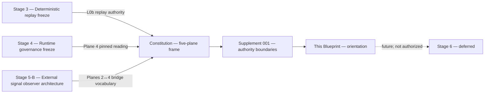
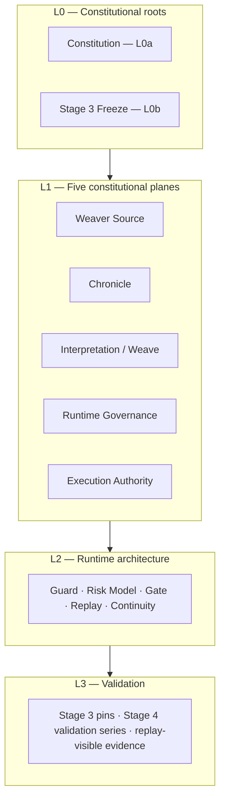
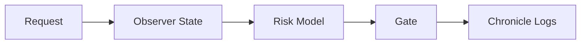
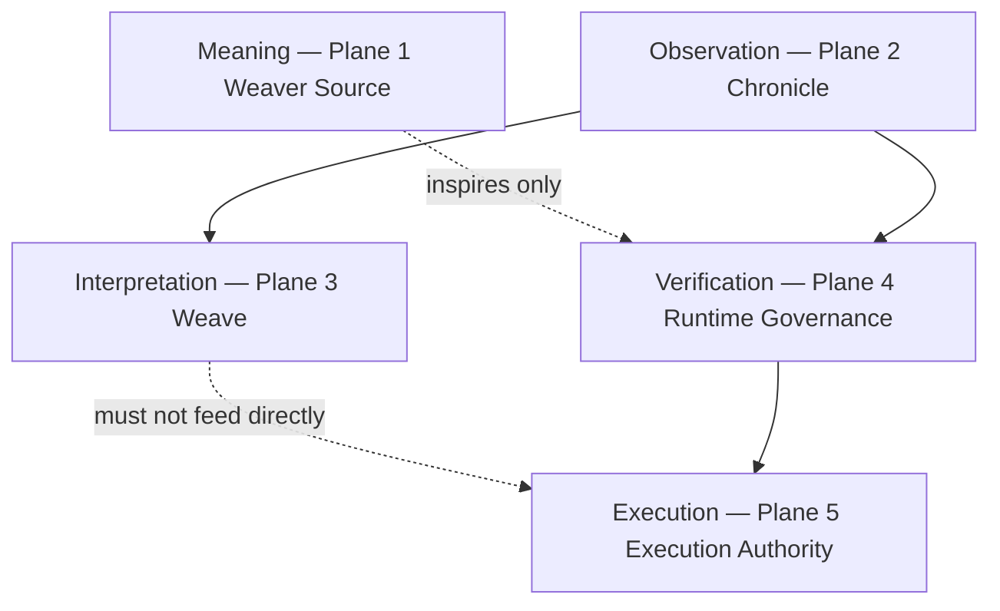
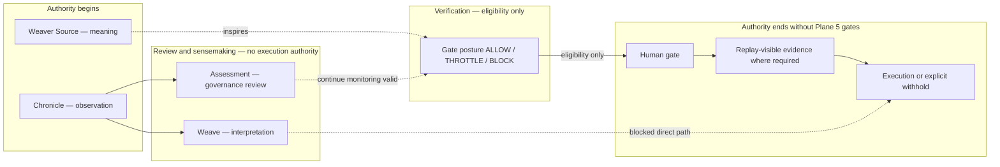
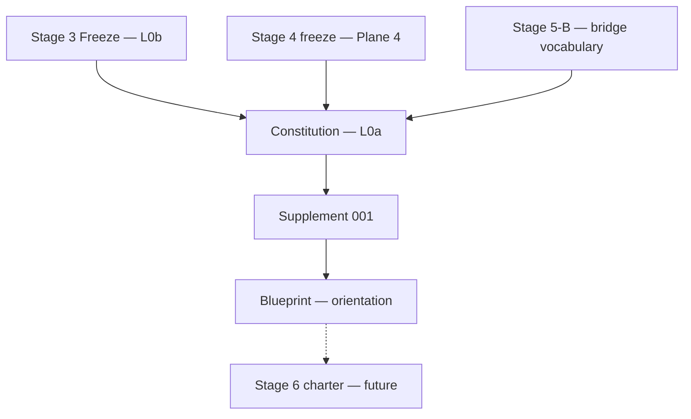
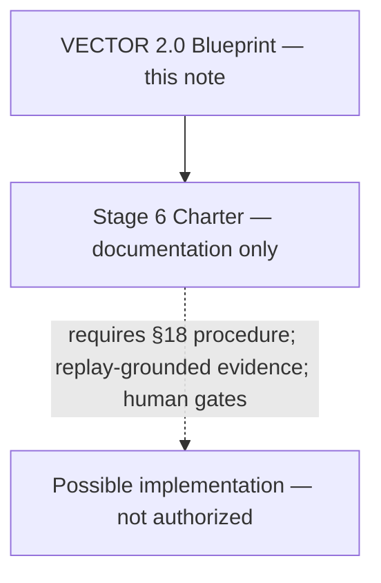

# VECTOR 2.0 — Architecture Blueprint

**Audience:** New contributors orienting to the VECTOR research program before reading milestone-specific notes or touching runtime code.  
**Document type:** Architecture orientation guide. Documentation only; not an implementation, deployment, or operations specification.

**Branch posture:** `stage4-runtime-governance` exploratory snapshot.

**Parent authority (read-only inheritance):**

- [[VECTOR_CONSTITUTION_MULTI_PLANE_ARCHITECTURE]] — L0a constitutional frame
- [[VECTOR_CONSTITUTION_SUPPLEMENT_001_AUTHORITY_BOUNDARIES]] — L0a boundary tightening

**Anchor milestones:** [[STAGE4_RUNTIME_GOVERNANCE_FREEZE]] · [[STAGE5B_EXTERNAL_SIGNAL_OBSERVER_ARCHITECTURE]] · [[STAGE4_FUTURE_EXTENSION_MAP]]

---

## Document posture

This blueprint is an **orientation guide**, not constitutional law.

| Property | Posture |
|----------|---------|
| **Authority** | Inherits L0a/L0b framing from the Constitution and Supplement; introduces **no new authority** |
| **Purpose** | Help new contributors navigate planes, layers, documents, and authority flow |
| **Scope** | Documentation only — no runtime changes, no schemas, no ingestion, no bridge activation |
| **Relationship to Constitution** | Summarizes and orients; does **not** replace, widen, or amend constitutional text |

When this blueprint and the Constitution disagree, **defer to the Constitution**. When homonym or channel ambiguity arises, **defer to the Supplement**.

---

## 1. Executive Summary

VECTOR is a **multi-plane research architecture** for AI safety governance. It is **not** only a runtime module. Meaning, observation, interpretation, verification, and execution are **distinct authority classes** with explicit boundaries between them.

The project rests on **two co-equal constitutional roots** that neither supersedes the other:

| Root | Designation | Governs |
|------|-------------|---------|
| **L0a** | VECTOR Constitution | Plane taxonomy, non-collapse rules, authority boundaries, extension procedure |
| **L0b** | Stage 3 freeze / deterministic replay authority | Pin-scoped offline validation, replay-visible evidence, declared comparison rules |

Above these roots, **five constitutional planes** span the full program:

1. **Weaver Source** — symbolic and participatory meaning
2. **Chronicle** — durable, append-only observation records
3. **Interpretation / Weave** — optional sensemaking and motif linkage
4. **VECTOR Runtime Governance** — admissibility, validation, Replay, Guard, Continuity, gate posture
5. **Execution Authority** — runtime mutation or boundary-crossing action through declared gates

**Core discipline in one line:** Meaning is not evidence; observation is not interpretation; interpretation is not verification; verification is not execution. Gate posture (ALLOW / THROTTLE / BLOCK) is **eligibility**, not execution authorization.

Stage 4 froze the **internal** runtime governance reading posture (primarily Plane 4). Stage 5-B defined **bridge vocabulary** between external symbolic observation (Plane 2) and runtime governance (Plane 4) without implementing ingestion. The Constitution and Supplement established the **top-level frame**. Stage 6 — controlled integration — remains **hypothetical and deferred**.

This blueprint orients contributors to that frame. It does not authorize implementation.

---

## 2. Historical Evolution

VECTOR work progressed in staged layers. Each stage answers a different question. Later stages **frame** earlier freeze authority; they do **not** silently replace it.

### Stage 3 — Deterministic replay freeze (L0b)

**Question:** Under declared fixtures, pins, and comparison rules, what replayed and what evidence admits a trace-grounded claim?

Stage 3 established the **frozen offline validation surface**: deterministic replay, replay-visible evidence gates, fixture-scoped validation, and pinned regression authority. Trace-grounded governance claims — pass/fail, parity, validator outcomes, pin-scoped behavior — defer to Stage 3 (L0b).

Stage 3 is **not** superseded by Stage 4 or any later milestone.

### Stage 4 — Runtime governance freeze (Plane 4)

**Question:** How does **internal** observer-aware runtime governance interpret trusted vs observed state under declared authority boundaries?

Stage 4 established the internal governance layer: gate semantics, state/payload awareness, replay authority boundaries, non-collapse interpretation boundaries, and mechanical validation on `notes/04 VECTOR/`. The canonical flow is:

**Request → Observer State → Risk Model → Gate → Chronicle Logs**

Stage 4 primarily occupies **Plane 4** (VECTOR Runtime Governance). Guard chronicle JSONL is a **governance-origin** durable record — distinct from chronicle-repo observation authority. Stage 4 does **not** subsume Planes 1–3 or Plane 5.

### Stage 5-B — External signal observer architecture (Planes 2 ↔ 4)

**Question:** How may **external** symbolic observations be recorded, assessed, and bounded so they do **not** silently influence runtime execution?

Stage 5-B defined bridge vocabulary between [vector-signal-chronicle](https://github.com/chrono-vector/vector-signal-chronicle) (upstream observation) and this repository (runtime governance). Its processing chain:

**External Signal → Observer Event → Self-Healing Assessment → Execution Boundary → Chronicle**

Default posture: **chronicle updated, runtime unchanged, monitoring continues**. Stage 5-B names four **bridge-scoped** planes — a specialized reading of the five-plane constitution, not a replacement (see §4 and Constitution §5).

### Constitution — Multi-plane architecture (L0a)

**Question:** Which plane owns what, and what may not collapse across planes?

The Constitution established the **five-plane top-level frame**, dual-root deference discipline (L0a / L0b), non-collapse invariants, execution ceilings, observer independence, provenance obligations, and the §18 amendment procedure. It frames Stage 4 and Stage 5-B without widening them.

### Supplement 001 — Authority boundaries (L0a tightening)

**Question:** Where do remaining compression boundaries need explicit discipline before Blueprint or Stage 6 work?

The Supplement tightened seven boundaries: Plane 4 internal channels, Assessment ≠ Weave, Chronicle homonym rule, Continuity disambiguation, read-only anticipation ceiling, Chronicle → Plane 4 review-only default, and L0a / L0b conflict handling. It clarifies the Constitution; it does not replace it.

### Deferred — Stage 6 controlled integration

**Question (hypothetical):** How might planes be **coordinated** across admission contracts and bridge depth **without** category collapse?

Stage 6 is **not implemented, scheduled, or authorized**. When considered in the future, it must preserve all non-collapse rules, require replay-grounded evidence for bridge activation claims, record boundary changes under extension policy, and satisfy the §18 amendment procedure. Stage 6 would **coordinate** across planes; it would **not** merge them into a single truth-source or autonomous control loop.

---

## 3. Architectural Layers

VECTOR documentation is organized in layers. Lower layers constrain higher layers. This table orients contributors; constitutional detail lives in L0 documents.

### L0 — Constitutional roots

| Component | Role | Authority class |
|-----------|------|-----------------|
| **Constitution** ([[VECTOR_CONSTITUTION_MULTI_PLANE_ARCHITECTURE]]) | Top-level five-plane frame, non-collapse rules, extension procedure | L0a — plane separation |
| **Stage 3 Freeze** | Deterministic replay on declared pins; replay-visible evidence gates | L0b — trace-grounded claims |

**Deference rule:** Trace-grounded claims → L0b. Plane-boundary claims → L0a. Mixed claims require **both** roots satisfied or an explicit human-recorded boundary decision.

### L1 — Five constitutional planes

| Plane | One-line role |
|-------|---------------|
| **Weaver Source** | Symbolic and participatory meaning — inspires, does not verify or execute |
| **Chronicle** | Append-only observation records with provenance — what was seen |
| **Interpretation / Weave** | Optional sensemaking — motifs, patterns, narrative hypotheses |
| **Runtime Governance** | Verification, admissibility, gate posture — what may be admitted under declared scope |
| **Execution Authority** | Runtime mutation or boundary-crossing action — gated, evidence-backed, human-approved where required |

Planes are **peers** in constitutional taxonomy. Runtime governance (Plane 4) is necessary but not sufficient for constitutional completeness.

### L2 — Runtime architecture

L2 is the **engineering expression** of Plane 4 under the Stage 4 freeze reading posture. It is research-prototype scope, not production enforcement.

| Component | Constitutional channel | Function (orientation) |
|-----------|------------------------|------------------------|
| **Guard** | Runtime Observation + Gate Evaluation | Observer-aware governance path evaluation; chronicle JSONL episodes |
| **Risk Model** | Runtime Observation | Scenario-bounded `observer_gap`, `observer_distrust`, `p_fail`, confidence |
| **Gate** | Gate Evaluation | Eligibility posture: ALLOW / THROTTLE / BLOCK |
| **Replay** | Replay Verification | Pin-scoped replay proof linkage (L0b) |
| **Continuity** | Validation / Continuity Lineage | Governance and validation lineage discipline |

**Stage 4 internal flow:**

L2 components live **inside Plane 4**. They do not own meaning (Plane 1), external observation authority (Plane 2), interpretive sensemaking (Plane 3), or execution authorization (Plane 5).

### L3 — Validation

L3 is the **evidence and mechanical validation surface** that grounds claims without collapsing into governance verdicts or execution authorization.

| Surface | Root | What it validates |
|---------|------|-------------------|
| **Stage 3 pins and fixtures** | L0b | Deterministic replay, bundle verification, validator outcomes, parity on declared scope |
| **Stage 4 validation series** | Plane 4 / research | Mechanical inspection on `notes/04 VECTOR/` — link integrity, graph navigability, manifest binding, replay-authority non-collapse hygiene |
| **Replay-visible evidence** | L0b primary | Manifests, bundles, stable replay logs, structured validator results under declared comparison rules |
| **Harness reproducibility** | Research discipline | Consistent pytest or scenario re-runs within declared scope — **distinct** from Stage 3 pin replay proof |

**Validation ceiling:** PASS rows, ALLOW outcomes, and closed-loop harness dynamics are **research evidence only**. They do not authorize deployment, merge, bridge activation, or execution.

---

## 4. Five Constitutional Planes

Each plane answers a different question. No plane is reducible to another. The following uses plain engineering language; constitutional definitions remain authoritative in [[VECTOR_CONSTITUTION_MULTI_PLANE_ARCHITECTURE]].

### Plane 1 — Weaver Source

| Dimension | Engineering reading |
|-----------|---------------------|
| **Question** | What does this work *mean* — symbolically, philosophically, participatorily? |
| **Owns** | Metaphor, Hunter's Dream, CAW (Context-Anchored Witnessing), participatory framing, narrative inspiration for research direction |
| **Does not own** | Runtime authority, admissibility verdicts, replay proof, gate decisions, execution eligibility |
| **Typical outputs** | Meaning-layer essays, philosophical anchors, participatory vocabulary |
| **Hard rule** | May inspire how researchers *read* governance questions. Must **never** be treated as verified runtime fact or as a control loop that mutates runtime state. |

### Plane 2 — Chronicle

| Dimension | Engineering reading |
|-----------|---------------------|
| **Question** | What was observed, when, from where, under what provenance? |
| **Owns** | Durable, append-only observation records; provenance boundaries; separation of raw observation from later interpretation |
| **Does not own** | Verification verdicts, gate posture, execution decisions, truth claims about external narratives |
| **Typical outputs** | Chronicle episodes, Observer Events (Stage 5-B vocabulary), permanent records of *what was seen* |
| **Hard rule** | Observation records are **append-only**. Corrections appear as **new episodes** or **explicit amendment records** — never silent rewrite. Chronicle is a **first-class peer** of runtime governance, not a subsidiary log format inside Plane 4. |

**Homonym warning (Supplement §4):** "Chronicle" without a plane label is ambiguous. **Plane 2 Chronicle** (observation authority, chronicle repo) ≠ **Guard Chronicle JSONL / Stage 4 Chronicle Logs** (governance-origin record, this repo).

### Plane 3 — Interpretation / Weave

| Dimension | Engineering reading |
|-----------|---------------------|
| **Question** | What patterns, motifs, links, or narrative hypotheses might connect observations? |
| **Owns** | Optional sensemaking — motif linkage, pattern hypotheses, external signal correlation, narrative weaving |
| **Does not own** | Direct execution influence, silent admission into runtime risk models, upgrade of interpretive confidence into verification authority |
| **Typical outputs** | Interpretive artifacts, scoring vocabularies, weave graphs — explicitly labeled as interpretation |
| **Hard rule** | Interpretation **must not feed execution directly**. Any path toward runtime influence must traverse Plane 4 verification and Plane 5 gates. |

**Distinction (Supplement §3):** **Weave** = *what might it mean or connect?* **Assessment** = *should governance posture change?* Neither answers *what may execute?*

### Plane 4 — VECTOR Runtime Governance

| Dimension | Engineering reading |
|-----------|---------------------|
| **Question** | What may be verified, admitted, replayed, or bounded under declared authority? |
| **Owns** | Admissibility, validation, Replay, Guard, Continuity, authority boundaries, replay-visible evidence discipline, gate posture under harness |
| **Does not own** | Symbolic meaning authority, chronicle observation authority, unbridged interpretive scoring as verified fact, autonomous execution, deployment/merge/production authorization |
| **Typical outputs** | Gate posture (ALLOW / THROTTLE / BLOCK); Guard chronicle JSONL; validation artifacts; replay-grounded reports |
| **Hard rule** | Gate posture is **eligibility**, not execution authorization. ALLOW does not auto-execute. |

**Plane 4 internal channels (Supplement §2)** — name the channel when citing Plane 4 authority:

| Channel | Question |
|---------|----------|
| **Replay Verification** | Under declared pins, what replayed and what does replay-visible evidence show? |
| **Runtime Observation** | Under harness scope, what internal observer state is present? |
| **Gate Evaluation** | Under declared governance path, what eligibility posture applies? |
| **Validation / Continuity Lineage** | What validation artifacts and governance lineage tie claims to declared authority? |

These four channels **must not collapse** into a single verdict or truth source.

### Plane 5 — Execution Authority

| Dimension | Engineering reading |
|-----------|---------------------|
| **Question** | What may **change runtime behavior** or cross an execution boundary, and under what evidence and approval? |
| **Owns** | Runtime mutation, recovery invocation, bridge activation, deployment actions — admitted only through declared gates, replay-visible evidence where required, and human approval where required |
| **Does not own** | Observation recording, interpretive sensemaking, meaning-layer inspiration, or governance eligibility verdicts alone |
| **Typical outputs** | Executed or explicitly withheld actions; audit-visible decision records |
| **Hard rule** | No **second autonomous control loop** parallel to the declared governance path. Chronicle updates, interpretive confidence, and ALLOW gate posture **alone** are insufficient. |

### Stage 5-B four bridge planes vs five constitutional planes

Stage 5-B names **four bridge planes** scoped to the external-signal path. This is a **specialized reading**, not a contradiction:

| Constitutional plane | Stage 5-B bridge plane |
|----------------------|------------------------|
| 1 — Weaver Source | *(not in bridge set)* |
| 2 — Chronicle | 4.1 External symbolic observation |
| 3 — Interpretation / Weave | *(partial overlap via assessment vocabulary)* |
| 4 — Runtime Governance | 4.2 Runtime observer; 4.3 Recovery (runtime recovery ≠ Self-Healing Assessment) |
| 5 — Execution Authority | 4.4 Execution control (default: **not activated** for symbolic external inputs) |

---

## 5. Authority Flow

Authority flows **downward through verification**, not upward from meaning or interpretation.

### Step-by-step flow

| Step | Plane | What happens | Where authority begins | Where authority ends |
|------|-------|--------------|------------------------|----------------------|
| **Meaning** | 1 — Weaver Source | Symbolic and participatory framing names research motivation and philosophical anchors | Owns *what the work means* to participants and researchers | Ends before evidence, verification, or execution. Cannot mutate runtime state. |
| **Observation** | 2 — Chronicle | External and cross-repo events are recorded with provenance; append-only discipline preserved | Owns *what was observed* and when | Ends before interpretation labels, verification verdicts, or gate posture. Observation ≠ verified fact. |
| **Interpretation** | 3 — Weave | Optional sensemaking connects observations; assessments review whether governance posture should change | Owns revisable interpretive hypotheses and non-executory governance review (Assessment / SHA) | Ends before silent admission as `observer_gap`, `p_fail`, or gate inputs. Weave does not authorize remediation. Assessment may conclude **continue monitoring**. |
| **Verification** | 4 — Runtime Governance | Admissibility, replay review, observer-state evaluation, gate posture under harness | Owns eligibility posture (ALLOW / THROTTLE / BLOCK) and replay-visible evidence linkage | Ends before execution authorization. ALLOW ≠ auto-execute. BLOCK ≠ chronicle invalidity. |
| **Execution** | 5 — Execution Authority | Boundary-crossing actions admitted through declared gates, replay-visible evidence where required, human approval where required | Owns *what may execute or mutate runtime* | Ends at the action boundary. Deployment, merge, and production authorization remain outside constitutional planes unless explicitly admitted operationally. |

### Authority ordering for trace-grounded questions

1. **Replay-visible evidence** (Stage 3 pins, L0b) remains primary where applicable.
2. **Runtime Governance** (Plane 4) informs, qualifies, or blocks within declared scope.
3. **Chronicle** (Plane 2) owns observation provenance for external signals.
4. **Interpretation** (Plane 3) owns revisable sensemaking — not verdict authority.
5. **Execution Authority** (Plane 5) acts only through declared gates.

### Where authority begins and ends — summary diagram

**Chronicle → Plane 4 default (Supplement §7):** Chronicle material may be **read** for governance review. Default outcome: **no runtime change**. Reading is not bridge activation. Assessment is not ingestion.

---

## 6. Relationship Between Documents

VECTOR documentation serves different authority functions. Contributors must know which document type they are reading.

| Document | Type | Purpose | Authority class |
|----------|------|---------|-----------------|
| **Constitution** ([[VECTOR_CONSTITUTION_MULTI_PLANE_ARCHITECTURE]]) | Constitutional (L0a) | Top-level five-plane frame, dual-root deference, non-collapse invariants, extension procedure | **Binding** for plane-separation and authority-boundary claims |
| **Supplement** ([[VECTOR_CONSTITUTION_SUPPLEMENT_001_AUTHORITY_BOUNDARIES]]) | Constitutional supplement (L0a) | Tightens compression boundaries: Plane 4 channels, Assessment ≠ Weave, Chronicle homonym, Continuity disambiguation, anticipation ceiling, Chronicle → Plane 4 default, L0a/L0b conflict handling | **Clarifies** the Constitution; does not replace or widen it |
| **Blueprint** (this note) | Orientation guide | Onboarding map for new contributors; inherits constitutional framing | **No authority** — summarizes and orients only |
| **Stage 4** ([[STAGE4_RUNTIME_GOVERNANCE_FREEZE]] and related notes) | Milestone freeze | Pins internal runtime governance reading posture — observer-aware layer, gate semantics, replay authority boundaries | **Canonical** for Plane 4 reading on `stage4-runtime-governance`; does not subsume other planes |
| **Stage 5-B** ([[STAGE5B_EXTERNAL_SIGNAL_OBSERVER_ARCHITECTURE]]) | Bridge vocabulary | Names how external symbolic observations relate to runtime governance without modifying runtime | **Vocabulary only** — no ingestion, no bridge activation, no runtime wiring |
| **Stage 3 Freeze** (e.g. `STAGE3_FREEZE_SUMMARY.md`, pin snapshots) | Validation freeze (L0b) | Deterministic replay on declared pins; fixture-scoped offline validation | **Canonical** for trace-grounded claims; not superseded by Stage 4 |

### How documents relate in practice

**Reading rule:** Start with this Blueprint for orientation, then read the Constitution for authoritative plane definitions, then the Supplement for boundary tightening, then milestone notes (Stage 4, Stage 5-B) for stage-specific vocabulary. Defer to Stage 3 corpus for any trace-grounded replay claim.

---

## 7. Non-Goals

The following are **explicit non-goals** for VECTOR work under the current constitutional frame. They apply to contributors, extension proposals, and any future Stage 6 consideration.

| Non-goal | Meaning |
|----------|---------|
| **No runtime self-modification from documentation** | Constitutional notes, Blueprint, and Stage 5-B vocabulary do not modify Guard, Replay, Continuity, harness, or evaluation paths |
| **No silent authority upgrade** | High interpretive confidence, narrative coherence, chronicle updates, or ALLOW gate posture must not silently promote into verification or execution planes |
| **No second autonomous control loop** | No parallel path from external narrative, interpretation, or meaning layer into execution bypassing declared governance |
| **No bypass of human authority** | Human approval remains **structural** for execution boundary crossing; monitoring equilibrium is a valid terminal state, not a defect |
| **No plane collapse** | Meaning ≠ evidence; observation ≠ interpretation; interpretation ≠ verification; verification ≠ execution; replay proof ≠ reproducibility alone |
| **No chronicle homonym confusion** | Plane 2 Chronicle and Guard Chronicle JSONL are distinct authority sources — must be explicitly labeled |
| **No implicit bridge activation** | Chronicle review ≠ ingestion; Assessment ≠ runtime change; Stage 5-B default is chronicle-only, runtime unchanged |
| **No Stage 6 implementation** | Controlled integration remains hypothetical until a separate charter satisfies §18 amendment procedure |
| **No deployment / merge / production authorization from research harness** | Closed-loop harness dynamics and validation PASS rows are research evidence only |
| **No Weaver Source as evidence** | Metaphor and participatory framing do not constitute replay-visible or runtime-verified evidence |
| **No external narrative as observer truth** | External symbolic signals must not silently populate `observer_gap`, `p_fail`, or gate inputs |
| **No anticipation as authority** | Forecasting and pattern recognition may remain read-only; anticipatory confidence does not create admissibility or execution eligibility |

---

## 8. Future Roadmap

Forward work follows a **documentation-first sequence**. Implementation remains outside default scope.

| Phase | Status | What it would address | What it does **not** authorize |
|-------|--------|----------------------|-------------------------------|
| **Blueprint** (current) | In progress | Contributor orientation; inherited L0a/L0b framing | Runtime changes, schemas, bridge activation |
| **Stage 6 Charter** | Future; documentation only | Scope, non-claims, bridge preconditions, planes touched and not touched | Ingestion, `Guard.evaluate` external-signal integration, Execution Control Bridge activation |
| **Possible implementation** | Deferred; not scheduled | Mechanical wiring only after charter, evidence plan, boundary admission, and §18 procedure | Silent widening of Stage 3 pin surface, plane collapse, autonomous execution |

### Stage 6 preconditions (from Constitution §14.3)

When Stage 6 is considered, it must:

- Declare which planes it touches and which it does not
- Preserve all non-collapse rules (Constitution §10)
- Require replay-grounded evidence for any bridge activation claim
- Record boundary change under extension policy
- Default Execution Control Bridge **not activated** for symbolic external inputs
- Satisfy the §18 amendment procedure

### Explicitly deferred work (orientation list)

| Deferred item | Plane(s) |
|---------------|----------|
| Stage 6 controlled integration design | 2, 3, 4, 5 |
| Bridge activation and admission depth | 4 ↔ 5 |
| Chronicle → governance ingestion hooks | 2 → 4 |
| Interpretation / Weave tooling | 3 |
| `Guard.evaluate` external-signal integration | 4 |
| Cross-plane artifact schemas | All |

No implementation details belong in this Blueprint. Forward items require the Constitution §18 amendment procedure.

---

## 9. Reading Order

Recommended sequence for **first-time contributors**:

| Order | Document | Why read it |
|-------|----------|-------------|
| **1** | **This Blueprint** ([[VECTOR_2_0_BLUEPRINT]]) | Orientation — layers, planes, authority flow, document map |
| **2** | **README.md** | Repository entry point; Stage 3/4 progression summary |
| **3** | **Constitution** ([[VECTOR_CONSTITUTION_MULTI_PLANE_ARCHITECTURE]]) | Authoritative five-plane frame and dual-root discipline |
| **4** | **Supplement 001** ([[VECTOR_CONSTITUTION_SUPPLEMENT_001_AUTHORITY_BOUNDARIES]]) | Channel, homonym, and compression boundary tightening |
| **5** | **Stage 4 freeze** ([[STAGE4_RUNTIME_GOVERNANCE_FREEZE]]) | Pinned internal runtime governance reading posture |
| **6** | **Stage 5-B** ([[STAGE5B_EXTERNAL_SIGNAL_OBSERVER_ARCHITECTURE]]) | External signal bridge vocabulary; default monitoring posture |
| **7** | **Stage 3 freeze summary** (`STAGE3_FREEZE_SUMMARY.md`) | L0b replay authority — required before making trace-grounded claims |
| **8** | **Future extension map** ([[STAGE4_FUTURE_EXTENSION_MAP]]) | Post-freeze extension paths — evidence-first, not authorized |

### By question type

| If you need to understand… | Read first… |
|----------------------------|-------------|
| Which plane owns a claim | Constitution §4, then Supplement homonym/channel sections |
| Whether a replay claim is valid | Stage 3 freeze corpus (L0b) |
| Internal governance flow | Stage 4 freeze, then runtime module docs under `core/` |
| External signal handling | Stage 5-B, then chronicle repo OBSERVER_GUIDELINES |
| Whether an extension is admissible | Constitution §18, Future extension map §6 |
| What VECTOR does **not** claim | Constitution §19, Supplement §9, this Blueprint §7 |

---

## 10. Glossary

Terms are defined for **orientation** only. Constitutional definitions in [[VECTOR_CONSTITUTION_MULTI_PLANE_ARCHITECTURE]] and [[VECTOR_CONSTITUTION_SUPPLEMENT_001_AUTHORITY_BOUNDARIES]] take precedence.

| Term | Definition |
|------|------------|
| **Constitution** | Top-level L0a document ([[VECTOR_CONSTITUTION_MULTI_PLANE_ARCHITECTURE]]) establishing the five-plane architecture, dual-root deference, non-collapse invariants, and extension procedure. Binding for plane-separation claims. |
| **Chronicle** | **Ambiguous without plane label** (Supplement §4). **Plane 2 Chronicle:** durable append-only observation records in [vector-signal-chronicle](https://github.com/chrono-vector/vector-signal-chronicle) — owns *what was observed*. **Guard Chronicle JSONL / Stage 4 Chronicle Logs:** governance-origin durable records in this repo under Stage 4 harness — owns *what the governance path recorded*. |
| **Replay** | Pin-scoped deterministic re-execution under declared fixtures, binding, schema versions, and comparison rules (L0b). Central invariant of Stage 3 freeze. Distinct from harness reproducibility and from narrative coherence. |
| **Continuity** | **Three senses — must not collapse** (Supplement §5). **VECTOR Continuity:** validation and governance lineage across declared authority (Plane 4). **Chronicle continuity:** observation permanence and traceability at the Plane 2 boundary. **Narrative continuity:** revisable interpretive sensemaking coherence (Plane 3). |
| **Weaver Source** | Plane 1 — symbolic and participatory meaning layer. Owns metaphor, philosophical anchors, and participatory framing. Inspires research; does not verify, gate, or execute. |
| **Assessment** | Non-executory governance review asking whether runtime, recovery, or execution control should change given what was observed. **Not** Weave. Self-Healing Assessment (SHA) is Assessment, not compositional interpretation. May conclude **continue monitoring**. Does not authorize remediation or execution. |
| **Weave** | Plane 3 interpretive sensemaking — compositional interpretation, motif linkage, pattern hypotheses across observations. Revisable. Does not authorize remediation or execution. |
| **Execution Authority** | Plane 5 — the action layer. Runtime mutation, recovery invocation, bridge activation, or other boundary-crossing operations admitted only through declared gates, replay-visible evidence where required, and human approval where required. |
| **Guard** | Plane 4 runtime governance component. Evaluates the governance path under harness scope; produces gate posture and Guard chronicle JSONL episodes. Gate decisions are eligibility signals, not execution authorization. |
| **Validation** | Mechanical and replay-grounded evidence discipline. Stage 3 validation (L0b): pin-scoped replay proof. Stage 4 validation series: mechanical inspection on documentation substrate. Validation PASS does not imply governance closure or execution authorization. |
| **Blueprint** | This document — orientation guide for new contributors. Inherits constitutional framing; introduces no new authority. Does not replace Constitution or Supplement. |

### Additional orientation terms

| Term | Brief definition |
|------|------------------|
| **Gate posture** | Plane 4 output: ALLOW / THROTTLE / BLOCK — eligibility under harness scope, not execution permission |
| **L0a** | Constitutional root — plane separation and authority boundaries |
| **L0b** | Stage 3 freeze root — deterministic replay and trace-grounded evidence |
| **Observer Event** | Stage 5-B / chronicle-plane structured artifact naming an external observation |
| **Monitoring equilibrium** | Valid terminal state: observations recorded, interpretation revisable, no runtime change, human execution approval not given |
| **Replay-visible evidence** | Artifacts (manifests, bundles, replay logs, validator results) tying trace-grounded claims to declared pins — primary admissibility class for L0b claims |
| **SHA (Self-Healing Assessment)** | Governance review step in Stage 5-B chain; default: no runtime change |

---

## Explicit non-claims (this Blueprint)

This orientation guide **does not**:

- Replace, widen, or amend the Constitution or Supplement
- Authorize Stage 6, bridge activation, ingestion, or runtime wiring
- Modify Guard, Replay, Continuity, harness, or evaluation paths
- Establish new principles, planes, or authority classes
- Confer deployment, merge, or production authorization
- Duplicate chronicle signal bodies or Weaver Source corpora

---

## Summary

VECTOR 2.0 is constitutionally a **five-plane architecture** under **dual-root authority** (L0a Constitution + L0b Stage 3 freeze). This Blueprint orients new contributors to that frame: historical evolution from Stage 3 through Stage 5-B to the Constitution and Supplement; layered architecture from L0 roots through L1 planes, L2 runtime components, and L3 validation; authority flow from Meaning through Observation, Interpretation, Verification, and Execution; document relationships; non-goals; and a documentation-first roadmap toward a hypothetical Stage 6 charter.

Read the Constitution for law. Read the Supplement for boundary tightening. Read this Blueprint for the map.

---

*End of VECTOR 2.0 architecture blueprint.*
