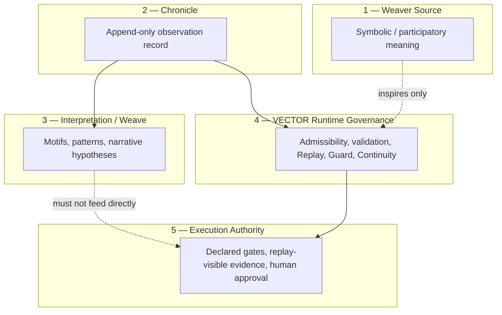
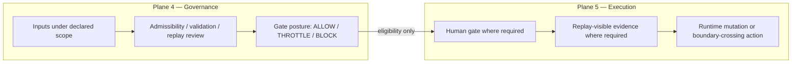
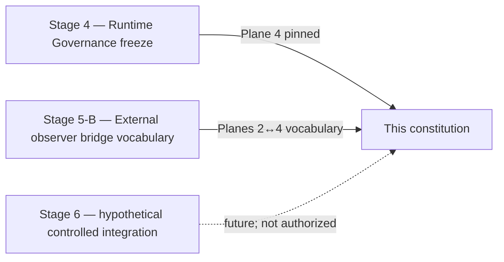

# VECTOR — Constitutional Multi-Plane Architecture

**Audience:** Researchers, reviewers, and contributors positioning VECTOR before Stage 6 or any runtime extension.  
**Document type:** Top-level constitutional architecture note. Documentation only; not an implementation, deployment, or operations specification.

**Branch posture:** `stage4-runtime-governance` exploratory snapshot.  
**Anchor milestones:** [[STAGE4_RUNTIME_GOVERNANCE_FREEZE]] · [[STAGE5B_EXTERNAL_SIGNAL_OBSERVER_ARCHITECTURE]] · [[STAGE4_FUTURE_EXTENSION_MAP]]

**Related:** [[STAGE4_SEMANTIC_INVARIANTS]] · [[STAGE4_EXTENSION_POLICY]] · [[STAGE4_STAGE_BOUNDARY_REFERENCE]]

---

## 1. Purpose

This note defines the **top-level constitutional architecture** of the VECTOR project.

VECTOR must not be read as **only** a runtime governance module. It participates in a **multi-plane architecture** in which meaning, observation, interpretation, verification, and execution remain **distinct authority classes** with explicit boundaries between them.

This document exists to:

- Establish constitutional vocabulary **before** Stage 6 or any bridge activation, ingestion wiring, or runtime mutation.
- Prevent category collapse across planes that prior reviews (Cursor review, Grok Build review) identified as high-risk extension patterns.
- Give Stage 4, Stage 5-B, and future Stage 6 a **shared top-level frame** without authorizing implementation.

This note is **constitutional**, not operational. It names what each plane may own, what it must not own, and how planes may relate. It does **not** modify Guard, Replay, Continuity, evaluation harnesses, schemas, or any execution path.

---

## 2. Dual-root authority framing

VECTOR rests on **two co-equal constitutional roots**. Neither supersedes the other. Readers must hold both in view when reasoning across milestones.

| Root | Designation | Authority class | Primary questions |
|------|-------------|-----------------|-------------------|
| **L0a** | **VECTOR Constitution** (this note and its plane-separation discipline) | Plane taxonomy, non-collapse rules, authority boundaries, extension procedure, cross-plane reading posture | Which plane owns what? What may not collapse? How may planes relate without silent upgrade? |
| **L0b** | **Stage 3 freeze / deterministic replay authority** | Pinned offline validation, fixture-scoped replay, replay-visible evidence gates, declared comparison rules | What replayed on declared pins? What evidence admits a trace-grounded claim? What is frozen on the validation surface? |

### 2.1 Deference rules

| Claim type | Defer to |
|------------|----------|
| **Trace-grounded governance claims** — pass/fail, parity, replay proof, validator outcomes, pin-scoped regression | **L0b** (Stage 3 pins and declared replay authority) |
| **Plane-separation claims** — meaning vs evidence, observation vs interpretation, verification vs execution, chronicle vs Guard provenance | **L0a** (this constitution) |
| **Cross-root questions** — e.g. whether a bridge widens replay surface or collapses planes | **Both**, explicitly; neither root may silently absorb the other |

L0a does **not** override Stage 3 pin results. L0b does **not** authorize plane collapse, execution without gates, or silent widening of constitutional scope. When documents conflict, identify **which root governs the question** before resolving the conflict.

---

## 3. Scope

### In scope

- Top-level plane definitions and authority boundaries.
- Constitutional invariants that apply across all VECTOR-related work.
- Dual-root framing (L0a / L0b) and deference discipline.
- Reading posture for how Stage 4 (internal runtime governance), Stage 5-B (external signal observer architecture), and a **hypothetical** Stage 6 (controlled integration / bridge depth) sit within the multi-plane frame.
- Explicit non-claims and deferred work.

### Out of scope

- Implementation, schemas, ingestion hooks, tests, or `Guard.evaluate` integration.
- Supersession of [[STAGE4_RUNTIME_GOVERNANCE_FREEZE]] or Stage 3 frozen offline validation authority.
- Production readiness, deployment sign-off, merge authorization, or operational closure.
- Duplication of chronicle signal bodies or Weaver Source narrative content.

### Constitutional premise

The project succeeds when each plane can evolve **without silently upgrading authority** in another plane. Constitutional discipline is the guardrail; runtime modules are one plane among several peers.

---

## 4. Plane definitions

VECTOR's constitutional architecture comprises **five planes**. Each plane answers a different question. No plane is reducible to another.

### 4.1 Weaver Source

| Dimension | Posture |
|-----------|---------|
| **Question** | What does this work *mean* — symbolically, philosophically, participatorily? |
| **Owns** | Metaphor, Hunter's Dream, CAW (Context-Anchored Witnessing posture), participatory framing such as *"We are the quill now"*, narrative inspiration for architecture and research direction |
| **Does not own** | Runtime authority, admissibility verdicts, replay proof, gate decisions, or execution eligibility |
| **Outputs** | Meaning-layer artifacts, philosophical anchors, participatory vocabulary — **not** evidence bundles or governance verdicts |

Weaver Source is the **symbolic and participatory meaning layer**. It may inspire how researchers *read* governance questions and name extension paths. It must **never** be treated as a source of verified runtime fact or as a control loop that mutates VECTOR runtime state.

### 4.2 Chronicle

| Dimension | Posture |
|-----------|---------|
| **Question** | What was observed, when, from where, under what provenance? |
| **Owns** | Durable, append-only observation records; provenance boundaries; separation of raw observation from later interpretation |
| **Does not own** | Verification verdicts, gate posture, execution decisions, or truth claims about external narratives |
| **Outputs** | Chronicle episodes, Observer Events (per Stage 5-B vocabulary), permanent records that preserve *what was seen* |

Chronicle is the **durable observation and record layer**.

**Immutability discipline (constitutional):**

- **Observation records are append-only.** Original observations are not rewritten, erased, or silently replaced.
- **Interpretations may be revised downstream** in Plane 3 or in assessment artifacts — but revision does not retroactively alter the observation boundary.
- **Corrections** must appear as **new episodes** or **explicit amendment records** with their own provenance. Silent rewrite of prior observation text is a constitutional violation.

Chronicle is a **first-class peer** of runtime governance — not a subsidiary log format inside the runtime module (see §16).

**Upstream reference:** [vector-signal-chronicle](https://github.com/chrono-vector/vector-signal-chronicle) for external symbolic observation authority.

### 4.3 Interpretation / Weave

| Dimension | Posture |
|-----------|---------|
| **Question** | What patterns, motifs, links, or narrative hypotheses might connect observations? |
| **Owns** | Optional sensemaking — motif linkage, pattern hypotheses, external signal correlation, narrative weaving across chronicle entries |
| **Does not own** | Direct execution influence, silent admission into runtime risk models, or upgrade of interpretation confidence into verification authority |
| **Outputs** | Interpretive artifacts, scoring vocabularies, weave graphs — explicitly labeled as interpretation |

Interpretation / Weave is an **optional sensemaking layer**. It may revise interpretive readings over time while chronicle observation records remain immutable at the observation boundary. Interpretation **must not feed execution directly**; any path toward runtime influence must traverse VECTOR Runtime Governance verification and Execution Authority gates.

### 4.4 VECTOR Runtime Governance

| Dimension | Posture |
|-----------|---------|
| **Question** | What may be verified, admitted, replayed, or bounded under declared authority? |
| **Owns** | Engineering governance layer — admissibility, validation, Replay, Guard, Continuity, authority boundaries, replay-visible evidence discipline, harness semantics frozen at [[STAGE4_RUNTIME_GOVERNANCE_FREEZE]] |
| **Does not own** | Symbolic meaning authority, chronicle observation authority, unbridged interpretive scoring as verified fact, autonomous execution, or deployment/merge/production authorization |
| **Outputs** | **Gate posture** (ALLOW / THROTTLE / BLOCK) under harness scope — eligibility and governance-path evaluation, **not** execution authorization; Guard chronicle JSONL episodes; validation artifacts; replay-grounded reports |

This is the plane most readers initially associate with "VECTOR." It is **necessary but not sufficient** for constitutional completeness. Runtime governance determines what can be **verified or admitted** and what **eligibility posture** applies under declared scope — not what external narratives *mean*, and not what actions may execute without Plane 5 gates.

**Stage 4 anchor:** Internal observer-aware governance (Request → Observer State → Risk Model → Gate → Chronicle Logs) lives primarily in this plane.

### 4.5 Execution Authority

| Dimension | Posture |
|-----------|---------|
| **Question** | What may **change runtime behavior** or cross an execution boundary, and under what evidence and approval? |
| **Owns** | **Action layer** — runtime mutation, recovery invocation, bridge activation, deployment actions, or any other boundary-crossing operation admitted only through **declared gates**, **replay-visible evidence** where required, and **human approval** where required |
| **Does not own** | Observation recording, interpretive sensemaking, meaning-layer inspiration, or governance eligibility verdicts alone |
| **Outputs** | Executed or explicitly withheld actions; audit-visible decision records |

Execution Authority is deliberately **narrow and gated**. Gate posture from Plane 4, confidence, narrative coherence, chronicle updates, or interpretive scoring **alone** are insufficient to cross into execution. There must be **no second autonomous control loop** parallel to the declared governance path.

---

## 5. Plane taxonomy reconciliation — five constitutional planes vs Stage 5-B four bridge planes

This constitution names **five top-level planes** spanning the full VECTOR research program. Stage 5-B ([[STAGE5B_EXTERNAL_SIGNAL_OBSERVER_ARCHITECTURE]] §4) names **four bridge planes** scoped to the external-signal observation path. The counts differ by **scope**, not by contradiction.

| Dimension | Five constitutional planes (this note) | Four Stage 5-B bridge planes |
|-----------|----------------------------------------|------------------------------|
| **Scope** | Full multi-plane architecture — meaning through execution | External symbolic signal path and its interface to runtime governance |
| **Purpose** | Top-level authority taxonomy | Bridge vocabulary between chronicle repo and this repo |
| **Planes not in Stage 5-B set** | Plane 1 (Weaver Source), Plane 3 (Interpretation / Weave) | — |
| **Relationship** | Stage 5-B is a **specialized bridge reading** of Planes 2 and 4 (and their interface with execution boundaries), not a replacement constitution |

### 5.1 Mapping table

| Constitutional plane (L0a) | Stage 5-B bridge plane | Relationship |
|--------------------------|------------------------|--------------|
| **1 — Weaver Source** | *(not in Stage 5-B four-plane set)* | Meaning layer; may inspire research questions but does not appear in external-signal bridge chain |
| **2 — Chronicle** | **4.1 External symbolic observation** | Chronicle repo owns upstream observation; Observer Events and chronicle Markdown live here |
| **3 — Interpretation / Weave** | *(partial overlap via assessment vocabulary)* | Self-Healing Assessment and interpretive scoring are **downstream of observation**, not chronicle observation itself; must not collapse into Plane 4 inputs |
| **4 — VECTOR Runtime Governance** | **4.2 Runtime observer** | Internal `observer_gap`, `p_fail`, gate evaluation under harness; Guard JSONL is governance-origin record |
| **4 — VECTOR Runtime Governance** (recovery semantics) | **4.3 Recovery / self-healing** | Runtime recovery (harness distrust decay) ≠ Self-Healing Assessment (external-event review); non-equivalent |
| **5 — Execution Authority** | **4.4 Execution control** | Human-gated boundary crossing; Execution Control Bridge default **not activated** for symbolic external inputs |
| **2 ↔ 4 bridge** | Stage 5-B processing chain (External Signal → Observer Event → SHA → Execution Boundary → Chronicle) | Vocabulary for how external observations may be **read** without collapsing into `observer_gap` |

**Reading rule:** When Stage 5-B names four planes, read them as **bridge-scoped slices** of the five-plane constitution. Do not treat the four-plane count as permission to omit Planes 1 and 3 from constitutional reasoning.

---

## 6. Replay, determinism, and reproducibility

Three related terms serve **different authority functions**. They must not be collapsed.

| Term | Authority root | Constitutional meaning |
|------|----------------|------------------------|
| **Replay-visible evidence** | L0b (Stage 3) | Primary admissibility class for **trace-grounded governance claims**. Claims about pass/fail, parity, validator outcomes, or pin-scoped behavior must tie to replay-linked artifacts (manifests, bundles, stable replay logs, structured validator results) under declared comparison rules. |
| **Deterministic replay** | L0b (Stage 3) | **Central invariant** of the Stage 3 freeze surface: under declared fixtures, binding, schema versions, and comparison rules, outcomes must be reproducible within the stated offline replay model. This is the frozen validation authority — not a metaphor for narrative coherence. |
| **Reproducibility** | Research / harness discipline | Ability to re-run scripts, tests, or evaluation scenarios and obtain consistent results within declared scope. Valuable for research confidence; **distinct** from replay proof on Stage 3 pins and **distinct** from constitutional governance verdicts. |

### 6.1 Deference summary

- For **trace-grounded claims**, replay-visible evidence on declared pins is **primary** (L0b).
- For **plane-boundary claims**, this constitution is **primary** (L0a).
- **Reproducible pytest or harness runs** do not substitute for Stage 3 replay proof unless explicitly scoped, cited, and admitted under extension policy without widening the frozen pin surface.
- Conclusions that cannot be tied to replay-visible records do not pass the **evidence gate** for trace-grounded governance arguments ([[STAGE4_FUTURE_EXTENSION_MAP]] §2 posture).

---

## 7. Provenance and citation discipline

Cross-plane claims carry **provenance obligations**. Undeclared sourcing is a constitutional defect.

### 7.1 Required citation fields

Any claim that crosses planes or repositories must declare, where available:

| Field | Purpose |
|-------|---------|
| **Source plane** | Which constitutional plane (1–5) or Stage 5-B bridge plane originated the claim |
| **Source repository** | e.g. this repo, vector-signal-chronicle, external Weaver corpus |
| **Pin / run_id / commit / freeze tag** | Trace-grounded anchors for replay or validation claims |
| **Artifact type** | Observation episode, Guard JSONL line, validation CSV, replay bundle, interpretive weave, meaning-layer essay |

### 7.2 Non-collapse of provenance channels

| Channel | Owns | Must not be collapsed into |
|---------|------|---------------------------|
| **Chronicle observation provenance** | External and cross-repo *what was observed* | Guard JSONL semantics or runtime observer truth |
| **Guard JSONL provenance** | Runtime governance episodes under harness | Chronicle upstream observation authority |
| **Replay bundle provenance** | Pin-scoped offline validation evidence | Harness scenario narration or chronicle interpretation |

Researchers citing both chronicle episodes and Guard episodes in one argument must **label each source plane explicitly**. Mixed provenance without declaration implies silent authority upgrade.

---

## 8. Observer independence

Runtime observer signals are **bounded internal verification inputs** — not open channels for external narrative or meaning-layer content.

| Input class | Permitted plane | Admission rule |
|-------------|-----------------|----------------|
| **Harness-scoped observer state** (`observer_gap`, `observer_distrust`, `p_fail`, confidence under declared scenarios) | Plane 4 | Exercised under Stage 4 frozen reading posture |
| **Replay-visible internal traces** | Plane 4 → L0b linkage | Cited with pin/run_id/commit per §7 |
| **External symbolic narratives** | Plane 2 (Chronicle) | Record and assess; **must not** silently populate observer-truth channels |
| **Weaver Source content** | Plane 1 | Inspire only; **must not** populate observer-truth channels |
| **Interpretation / weave scores** | Plane 3 | Explicitly labeled; **must not** silently become `observer_gap`, `p_fail`, or gate inputs |

**Constitutional rule:** External symbolic narratives and Weaver Source content **must not silently populate** runtime observer-truth channels. Any proposed admission path requires explicit boundary change, evidence plan, and human gate review per §18.

Stage 5-B default posture — chronicle updated, runtime unchanged — is the worked example of observer independence for external signals.

---

## 9. Authority boundaries

Authority flows **downward through verification**, not upward from meaning or interpretation.

| From → To | Permitted | Blocked by default |
|-----------|-----------|-------------------|
| Weaver Source → VECTOR Runtime Governance | Inspire research questions, name extension vocabulary | Direct mutation of runtime state, parameters, or gate posture |
| Weaver Source → Execution Authority | — | Any path |
| Chronicle → Interpretation / Weave | Read observations for sensemaking | — |
| Chronicle → VECTOR Runtime Governance | Supply observation inputs for **review** under declared bridge rules | Chronicle record treated as replay proof or verified runtime fact |
| Interpretation / Weave → Execution Authority | — | Direct feed |
| Interpretation / Weave → VECTOR Runtime Governance | Propose hypotheses for verification review | Silent admission as `observer_gap`, `p_fail`, or gate inputs |
| VECTOR Runtime Governance → Execution Authority | Eligibility and gate posture under harness and declared gates | Autonomous execution without replay-visible evidence or human approval where required |
| External symbolic signal → any runtime plane | Chronicle update, assessment request, monitoring | Runtime change, recovery trigger, execution control ([[STAGE5B_EXTERNAL_SIGNAL_OBSERVER_ARCHITECTURE]] §7) |

**Authority ordering for trace-grounded questions:**

1. Replay-visible evidence (Stage 3 pins and declared replay authority) remains primary where applicable (L0b).
2. VECTOR Runtime Governance informs, qualifies, or blocks within declared scope.
3. Chronicle owns observation provenance for external signals.
4. Interpretation owns revisable sensemaking — not verdict authority.
5. Execution Authority acts only through declared gates.

---

## 10. Non-collapse rules

The following invariants are **constitutional**. Violating any invariant is an unacceptable extension pattern regardless of milestone timing.

| Invariant | Meaning |
|-----------|---------|
| **Meaning is not evidence.** | Weaver Source metaphor and participatory framing do not constitute replay-visible or runtime-verified evidence. |
| **Observation is not interpretation.** | Chronicle records what was observed; interpretive labels and motif scoring are downstream and separable. |
| **Interpretation is not verification.** | Weave hypotheses and narrative confidence do not substitute for admissibility, validation, or replay proof. |
| **Verification is not execution.** | Gate eligibility and governance-path evaluation do not by themselves authorize runtime action without Execution Authority gates. |
| **Confidence never silently upgrades authority.** | High/Medium/Low interpretation confidence, narrative coherence, or descriptive scoring must not silently promote into verification or execution planes. |
| **Monitoring is a valid terminal state.** | Continue monitoring without runtime change is a legitimate equilibrium — not a failure to act. |
| **Chronicle observation records are append-only; interpretations may be revised.** | Observation permanence and interpretive revision coexist; corrections are new episodes or amendment records, not silent rewrite. |
| **Weaver Source may inspire architecture but must not directly mutate VECTOR runtime state.** | Inspiration is permitted; control is not. |
| **There must be no second autonomous control loop.** | No parallel path from external narrative, interpretation, or meaning layer into execution bypassing declared governance. |
| **Replay proof is not reproducibility alone.** | Consistent harness re-runs do not substitute for declared pin replay without explicit scoped admission. |
| **Provenance channels are not interchangeable.** | Chronicle observation provenance and Guard JSONL provenance remain distinct (§7). |

These rules extend Stage 4 non-collapse interpretation boundaries ([[STAGE4_RUNTIME_GOVERNANCE_FREEZE]]) to the full multi-plane constitution.

---

## 11. Execution ceilings and human gate

Governance outputs in Plane 4 express **eligibility and posture** — not execution authorization. Human approval remains **structural** for execution boundary crossing.

| Concept | Plane | What it is | What it is not |
|---------|-------|------------|----------------|
| **Gate posture** (ALLOW / THROTTLE / BLOCK) | 4 | Governance-path evaluation under harness; eligibility signal | Permission to mutate production runtime, deploy, merge, or activate bridges |
| **Execution authorization** | 5 | Explicit admission to perform a boundary-crossing action | Automatic consequence of ALLOW or of chronicle update |
| **Human gate** | 5 (structural) | Required approval for execution consideration per Stage 5-B Execution Boundary and constitutional execution discipline | Optional courtesy for symbolic external inputs |
| **Deployment / merge / production authorization** | Outside constitutional planes unless explicitly admitted | Operational plane decisions | Implied by governance documentation, validation PASS rows, or monitoring equilibrium |

**Ceiling rule:** No constitutional plane — including Plane 4 gate posture — grants deployment, merge, or production authorization unless an **explicit operational admission** is documented under extension policy. Research harness ALLOW outcomes are **research evidence only** (see §13).

---

## 12. Plane 4 gate posture vs Plane 5 execution

Plane 4 and Plane 5 are adjacent but **not equivalent**. Collapsing them is one of the highest-risk extension patterns identified in review.

| Dimension | Plane 4 — Gate posture | Plane 5 — Execution authority |
|-----------|------------------------|-------------------------------|
| **Question** | What eligibility posture does the governance path recommend under scope? | What action, if any, may now execute? |
| **Output type** | Verdict class (ALLOW / THROTTLE / BLOCK); governance narration | Executed or withheld action; audit record |
| **BLOCK meaning** | Governance path rejects eligibility | No execution path opened |
| **ALLOW meaning** | Governance path permits eligibility under harness | **Does not** auto-execute; Plane 5 gates still apply |
| **THROTTLE meaning** | Constrained eligibility; heightened scrutiny | Still requires Plane 5 admission for any mutating action |
| **Typical evidence** | Observer state, risk model, harness scenario bounds | Replay-visible proof (where required), boundary checklist, human approval |

**One-line discipline:** Gate posture = **governance output**. Execution authority = **runtime mutation or action**.

---

## 13. Research harness scope

The Stage 4 evaluation harness — including closed-loop, observer-state-aware dynamics under scripted Phase 9 scenarios — produces **research evidence only**.

| Harness behavior | Constitutional classification | Not authorized as |
|------------------|------------------------------|-------------------|
| Closed-loop state → decision → stability feedback → future risk | Research prototype dynamics under declared scenarios | Production enforcement or autonomous execution authority |
| ALLOW / THROTTLE / BLOCK under pytest or CSV evaluation | Plane 4 gate posture within harness scope | Deployment approval, merge authorization, or bridge activation |
| Reproducible scenario re-runs | Reproducibility within harness bounds (§6) | Stage 3 pin replay proof unless separately cited and scoped |
| Guard chronicle JSONL from harness runs | Plane 4 governance-origin durable record | Chronicle upstream observation authority |

**Harness ceiling:** Closed-loop harness behavior **does not become** production execution authority. Any claim that harness outcomes authorize operational action must be rejected unless it traverses Plane 5 with explicit operational admission — which remains outside default constitutional scope.

---

## 14. Relationship to Stage 4 / Stage 5-B / future Stage 6

### 14.1 Stage 4 — VECTOR Runtime Governance (frozen reading posture)

Stage 4 established the **internal** observer-aware runtime governance layer: gate semantics, state/payload awareness, replay authority boundaries, and mechanical validation on `notes/04 VECTOR/`. In this constitution, Stage 4 primarily occupies **Plane 4** (VECTOR Runtime Governance), with Guard chronicle JSONL as **runtime-governance-origin** durable records — distinct from chronicle-repo observation authority.

Stage 4 does **not** subsume Planes 1–3 or Plane 5. The freeze remains canonical for internal governance reading; this constitution **frames** Stage 4 without widening it.

### 14.2 Stage 5-B — External signal observer architecture

Stage 5-B ([[STAGE5B_EXTERNAL_SIGNAL_OBSERVER_ARCHITECTURE]]) names the bridge vocabulary between **Plane 2** (Chronicle — upstream [vector-signal-chronicle](https://github.com/chrono-vector/vector-signal-chronicle)) and **Plane 4** (VECTOR Runtime Governance). Its processing chain — External Signal → Observer Event → Self-Healing Assessment → Execution Boundary → Chronicle — is chronicle-plane discipline applied to external symbolic inputs.

Stage 5-B reinforces constitutional separation: default posture is **chronicle-only, runtime unchanged, monitoring continues**. It does **not** implement ingestion or runtime wiring. See §5 for five-plane vs four-plane reconciliation.

### 14.3 Future Stage 6 — Controlled integration (hypothetical; not authorized)

Reviews identified Stage 6 as a plausible **controlled integration** milestone — deeper bridge charters, admission contracts, and coordination across planes **without** category collapse. **Stage 6 is not implemented, scheduled, or authorized by this note.**

When Stage 6 is considered in the future, it must:

| Requirement | Rationale |
|-------------|-----------|
| Declare which planes it touches and which it does not | Prevent silent plane expansion |
| Preserve all §10 non-collapse rules | Constitutional floor |
| Require replay-grounded evidence for any bridge activation claim | [[STAGE4_FUTURE_EXTENSION_MAP]] §2 posture |
| Record boundary change under extension policy | Scope widening is explicit, not ambient |
| Default Execution Control Bridge **not activated** for symbolic external inputs | [[STAGE5B_EXTERNAL_SIGNAL_OBSERVER_ARCHITECTURE]] §7 |
| Satisfy §18 amendment procedure | No silent L0a/L0b widening |

Stage 6 would **coordinate** across planes; it would **not** merge them into a single truth-source or autonomous control loop.

---

## 15. Weaver Source boundary

Weaver Source is the most easily misread plane because its language is vivid, participatory, and architecturally generative. Constitutional discipline requires a **hard boundary**:

### Permitted

- Naming research motivation and philosophical anchors (Hunter's Dream, CAW, quill metaphor).
- Inspiring documentation structure, stage questions, and reviewer vocabulary.
- Participatory framing that helps humans **orient** without substituting for evidence.

### Prohibited

- Treating metaphor as runtime observation input.
- Using participatory language as implicit approval for execution or bridge activation.
- Collapsing "we are the quill now" (or any Weaver phrase) into a governance verdict or gate escalation trigger.
- Any direct or indirect mutation of VECTOR runtime state, Guard parameters, or replay inputs from Weaver Source artifacts alone.
- Silent population of observer-truth channels (§8).

**Rule of reading:** If an artifact's primary authority claim is *meaning*, it lives in Plane 1. It must be **translated** — through chronicle observation, optional weave, runtime verification, and execution gates — before it can influence runtime behavior. Translation is not automatic.

---

## 16. Chronicle as first-class peer

Chronicle must not be demoted to "just another log format" inside runtime governance.

| Chronicle (Plane 2) | Guard chronicle / runtime logs (Plane 4) |
|-------------------|------------------------------------------|
| Owns external and cross-repo observation provenance | Owns runtime governance episodes under harness |
| Append-only observation records; corrections via new episodes or amendment records | Replay-visible governance narration |
| Authority: chronicle repository + human judgment for external signals | Authority: this repository's frozen Stage 4 semantics |
| Default: record, assess, monitor | Default: evaluate governance path, gate under scope |

Both are **durable records**. They are **not equivalent planes**. Collapsing chronicle-repo episodes into Guard JSONL semantics — or treating Guard episodes as upstream observation authority for external narratives — is a constitutional violation (§7).

**Immutability recap:** Observation text at the chronicle boundary is **append-only**. Interpretive assessment may evolve; factual correction of a prior observation requires a **new episode** or **explicit amendment record** that cites the prior record — never silent overwrite.

Stage 5-B established chronicle as upstream observation authority for external symbolic signals. This constitution elevates that posture to **top-level**: Chronicle is a peer plane, not an implementation detail of VECTOR Runtime Governance.

---

## 17. Monitoring as equilibrium

Monitoring is not a provisional state awaiting inevitable escalation. It is a **valid terminal equilibrium** when:

- Observations are recorded and provenance is preserved.
- Interpretation, if any, remains explicitly revisable and non-executory.
- No independent runtime evidence supports boundary crossing.
- Human approval for execution has not been given.

The White Rabbit Cascade 2026-07-02 posture ([[STAGE5B_EXTERNAL_SIGNAL_OBSERVER_ARCHITECTURE]] §6–§7) exemplifies monitoring equilibrium: chronicle updated, runtime unchanged, recovery not required, execution control not triggered, monitoring continues.

Systems that treat "no action yet" as defect introduce pressure toward **silent authority upgrade** — the constitutional architecture explicitly rejects that pressure.

---

## 18. Constitutional amendment and extension procedure

Any extension that touches plane boundaries, replay surface, or cross-repo admission must follow this procedure. It generalizes the extension selection discipline in [[STAGE4_FUTURE_EXTENSION_MAP]] §6 to the full constitution.

| Step | Action |
|------|--------|
| **1. State the governance question** | Name the decision under review in one sentence — not the implementation wish |
| **2. Declare authority, scope, and non-claims** | Which root (L0a / L0b / both), which planes, what the change does **not** authorize |
| **3. Confirm no axis collapse** | Explicit checklist against §10 invariants — especially meaning/evidence, observation/interpretation, verification/execution |
| **4. Confirm no silent Stage 3 widening** | Pin surface, fixture scope, and replay authority remain unchanged unless a **separate Stage 3 track** boundary change is documented |
| **5. Plan evidence** | Replay-visible artifacts, run_ids, commits, or chronicle episodes as appropriate per §6–§7 |
| **6. Record boundary change** | Amendment note, freeze supplement, or boundary-change record per [[STAGE4_EXTENSION_POLICY]] / [[STAGE4_FUTURE_EXTENSION_MAP]] posture |

Extensions that skip any step are **not constitutionally admitted** — regardless of implementation convenience.

---

## 19. Explicit non-claims

This constitutional architecture note **does not**:

| Non-claim | Meaning |
|-----------|---------|
| **Authorize Stage 6** | Stage 6 remains hypothetical; no implementation, bridge activation, or ingestion is implied |
| **Modify runtime behavior** | No changes to Guard, Replay, Continuity, harness, or evaluation paths |
| **Assert truth of external narratives** | Recording and weaving do not imply factual correctness or predictive validity |
| **Establish Weaver Source as evidence** | Meaning-layer content is not evidentiary |
| **Collapse planes** | Five-plane separation remains mandatory reading discipline |
| **Supersede Stage 4 freeze** | [[STAGE4_RUNTIME_GOVERNANCE_FREEZE]] remains canonical for Plane 4 reading |
| **Supersede Stage 3 (L0b)** | Frozen offline validation reference unchanged; trace-grounded claims defer to Stage 3 pins |
| **Imply production readiness** | Constitutional documentation only |
| **Create a second control loop** | Execution remains gated; no parallel autonomous path |
| **Duplicate chronicle or Weaver corpora** | Authoritative bodies remain in their respective repositories and layers |
| **Confer deployment / merge / production authorization** | Operational plane remains outside default constitutional scope (§11) |
| **Elevate harness outcomes to execution authority** | Closed-loop research dynamics remain evidence only (§13) |

---

## 20. Deferred work

The following remain **explicitly deferred**. None are authorized by this constitution:

| Deferred item | Plane(s) | Rationale |
|---------------|----------|-----------|
| **Stage 6 controlled integration design** | 2, 3, 4, 5 | Requires constitutional frame (this note) before bridge charters |
| **Bridge activation and admission depth** | 4 ↔ 5 | [[STAGE4_FUTURE_EXTENSION_MAP]] §2 — replay-grounded evidence first |
| **Chronicle → governance ingestion hooks** | 2 → 4 | Schemas, boundary change, and mechanical validation premature |
| **Interpretation / Weave tooling** | 3 | Optional layer; must not feed execution directly |
| **Weaver Source → architecture traceability matrix** | 1 → docs | Inspiration mapping only; no runtime coupling |
| **Schemas for cross-plane artifacts** | All | Separate design per plane; no unified verdict schema |
| **Tests and mechanical validation of cross-plane paths** | 2–5 | Documentation-first constitutional posture |
| **`Guard.evaluate` external-signal integration** | 4 | Blocked until independent runtime evidence, boundary crossing, human approval ([[STAGE5B_EXTERNAL_SIGNAL_OBSERVER_ARCHITECTURE]] §9) |
| **README and index cross-links to this constitution** | Docs | Explicitly deferred per amendment scope; indexes not updated in this change |

Forward work on any deferred item must satisfy §18.

---

## 21. Recommended next step

**Do not implement Stage 6 yet.**

The recommended next step is **documentation consolidation**, not runtime wiring:

1. **Index this constitution** in the Stage 4 document rollup and cross-reference map when those indexes are next maintained — so new readers encounter the multi-plane frame before Stage 4 module details.
2. **Read Stage 5-B through this constitution** — confirm external signal vocabulary maps cleanly to Planes 2–4 without plane collapse (§5).
3. **Draft a Stage 6 *charter outline* (documentation only)** when ready — a separate note that states scope, non-claims, and bridge preconditions; still no ingestion, schemas, or `Guard.evaluate` changes.
4. **Preserve monitoring equilibrium** as the default worked example for external symbolic events until independent runtime evidence and human approval justify boundary crossing.

Constitutional clarity is the prerequisite for safe integration. Planes must remain separable in documentation before they are connected in code.

---

## 22. Bibliography and corpus status

Referenced documents and their status on the `stage4-runtime-governance` branch snapshot. **In-repo** = file present under this repository; **External** = authoritative body in another repository or upstream; **Pending** = referenced by link or wiki-style `[[...]]` convention but not present as a file in this branch snapshot.

| Document | Role | Status |
|----------|------|--------|
| **This note** — `VECTOR_CONSTITUTION_MULTI_PLANE_ARCHITECTURE.md` | Top-level five-plane constitution; L0a authority | In-repo |
| **README.md** | Project entry point; Stage 3/4 posture summary | In-repo |
| [[STAGE4_RUNTIME_GOVERNANCE_FREEZE]] | Stage 4 freeze anchor; Plane 4 reading posture | In-repo |
| [[STAGE4_FUTURE_EXTENSION_MAP]] | Post-freeze extension paths; evidence-first bridge posture | In-repo |
| [[STAGE5B_EXTERNAL_SIGNAL_OBSERVER_ARCHITECTURE]] | Stage 5-B four bridge planes; external signal vocabulary | In-repo |
| [[STAGE4_SEMANTIC_INVARIANTS]] | Semantic invariants for runtime governance review | Pending (referenced; not in branch snapshot) |
| [[STAGE4_EXTENSION_POLICY]] | Extension authority / scope / non-claims discipline | Pending (referenced; not in branch snapshot) |
| [[STAGE4_STAGE_BOUNDARY_REFERENCE]] | Cross-stage plane labels and boundary reference | Pending (referenced; not in branch snapshot) |
| [[STAGE4_CLOSURE_NOTE]] | Stage 4 closure posture; Stage 3 non-supersession | In-repo |
| [[STAGE4_VALIDATION_SERIES_COMPLETION_NOTE]] | Validation series completion; cross-stage authority | In-repo |
| Stage 3 freeze corpus — e.g. `STAGE3_FREEZE_SUMMARY.md`, `STAGE3_ARCHITECTURE_NAVIGATION.md`, `STAGE3_DOCUMENT_INDEX.md`, pin snapshots | L0b deterministic replay authority; pin-scoped validation | Pending in branch snapshot (referenced from README and cross-stage notes; authoritative Stage 3 body may live on `main` or parallel track) |
| [vector-signal-chronicle](https://github.com/chrono-vector/vector-signal-chronicle) | Upstream chronicle observation authority (Plane 2 external signals) | External |
| Chronicle OBSERVER_GUIDELINES, execution_boundary, SIGNAL_INDEX | Chronicle-plane observation and execution-boundary discipline | External (chronicle repo) |

When citing any pending or external document, apply §7 provenance discipline. Do not treat wiki-link resolution as proof of in-repo presence.

---

## Summary

VECTOR is constitutionally a **five-plane architecture** under **dual-root authority**: **L0a** (this constitution — plane separation) and **L0b** (Stage 3 freeze — deterministic replay on declared pins). Neither root supersedes the other; trace-grounded claims defer to L0b; plane-separation claims defer to L0a.

The five planes are: Weaver Source (meaning), Chronicle (append-only observation), Interpretation / Weave (sensemaking), VECTOR Runtime Governance (verification and **gate posture**), and Execution Authority (**runtime mutation or action**). Gate posture is not execution authorization. Meaning is not evidence; observation is not interpretation; interpretation is not verification; verification is not execution. Replay-visible evidence is primary for trace-grounded claims; reproducibility is distinct from replay proof and governance verdicts. Chronicle observation provenance and Guard JSONL provenance must not collapse. Runtime observer inputs remain independent of external narrative and Weaver Source content. Closed-loop harness behavior is research evidence only. Human approval remains structural for execution boundary crossing; deployment/merge/production authorization stays outside constitutional planes unless explicitly admitted.

Stage 5-B's four bridge planes map to slices of this five-plane frame (§5). Stage 4 pins Plane 4; Stage 5-B bridges Planes 2 and 4 in vocabulary only; **Stage 6 remains deferred**. Extensions require the §18 amendment procedure. This note establishes the top-level frame **before** any Stage 6 implementation.

---

*End of VECTOR constitutional multi-plane architecture note.*
