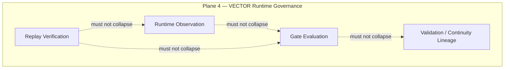

# VECTOR — Constitutional Supplement 001: Authority Boundaries

**Audience:** Researchers, reviewers, and contributors tightening constitutional compression boundaries before VECTOR 2.0 Blueprint or any Stage 6 charter work.  
**Document type:** Constitutional supplement. Documentation only; not an implementation, deployment, or operations specification.

**Branch posture:** `stage4-runtime-governance` exploratory snapshot.  
**Parent authority:** [[VECTOR_CONSTITUTION_MULTI_PLANE_ARCHITECTURE]] (L0a — plane separation and authority boundaries)  
**Co-root:** Stage 3 freeze / deterministic replay authority (L0b — trace-grounded claims)

**Anchor milestones:** [[STAGE4_RUNTIME_GOVERNANCE_FREEZE]] · [[STAGE5B_EXTERNAL_SIGNAL_OBSERVER_ARCHITECTURE]] · [[STAGE4_FUTURE_EXTENSION_MAP]]

**Related:** [[STAGE4_CLOSURE_NOTE]] · [[STAGE4_VALIDATION_SERIES_COMPLETION_NOTE]]

---

## 1. Purpose

This supplement tightens **remaining compression boundaries** identified in Grok's final constitutional review. It exists to resolve homonym collisions, internal Plane 4 channel confusion, and cross-root dispute posture **before** any VECTOR 2.0 Blueprint or Stage 6 charter is drafted.

This note **clarifies** the parent constitution. It does **not** replace it, widen it, or authorize implementation.

**Scope of this supplement:**

| Topic | Clarification |
|-------|---------------|
| Plane 4 internal authority channels | Replay Verification, Runtime Observation, Gate Evaluation, Validation / Continuity Lineage |
| Assessment ≠ Weave | Governance review vs compositional sensemaking |
| Chronicle homonym rule | Plane 2 Chronicle vs Guard Chronicle JSONL / Stage 4 Chronicle Logs |
| Continuity disambiguation | VECTOR Continuity vs chronicle continuity vs narrative continuity |
| Read-only anticipation ceiling | Prediction and pattern recognition without authority upgrade |
| Chronicle → Plane 4 default | Review-only posture; no silent bridge |
| L0a / L0b conflict handling | Classification and deference discipline |

---

## 2. Plane 4 Internal Authority Channels

Plane 4 — **VECTOR Runtime Governance** — is a single constitutional plane but contains **distinct sub-authority channels**. Each channel answers a different question. **MUST NOT collapse** any pair into a single verdict or truth source.

### 2.1 Channel definitions

| Channel | Question | Owns | Does not own |
|---------|----------|------|--------------|
| **Replay Verification** | Under declared pins and comparison rules, what replayed and what does replay-visible evidence show? | Pin-scoped replay proof, validator outcomes, parity claims, bundle-linked trace grounding (L0b linkage) | Runtime observer dynamics, gate posture, chronicle permanence, narrative coherence |
| **Runtime Observation** | Under harness scope, what internal observer state and scenario-bounded signals are present? | `observer_gap`, `observer_distrust`, `p_fail`, confidence under declared scenarios; harness-scoped observation narration | Replay proof on Stage 3 pins, external symbolic observation authority, execution authorization |
| **Gate Evaluation** | Under declared governance path, what eligibility posture applies? | Gate posture (ALLOW / THROTTLE / BLOCK) as governance-path output | Execution authorization, deployment approval, bridge activation, replay proof alone |
| **Validation / Continuity Lineage** | What validation artifacts, continuity records, and governance lineage tie claims to declared authority? | Validation series posture, continuity lineage discipline, extension-boundary records | Chronicle observation permanence, interpretive weave graphs, meaning-layer inspiration |

### 2.2 Non-collapse rules (Plane 4 internal)

| Pair | MUST NOT collapse because |
|------|---------------------------|
| **Replay verification ≠ runtime observation** | Replay proof answers *what replayed on declared pins*; runtime observation answers *what the harness-scoped observer model reports under scenario*. A passing replay does not substitute for observer-state narration, and observer dynamics do not constitute pin-scoped replay proof. |
| **Runtime observer dynamics ≠ replay proof** | Closed-loop harness dynamics (state → decision → stability feedback) are research evidence within Plane 4 scope. They are **not** Stage 3 deterministic replay authority unless separately cited, scoped, and admitted under L0b without widening the frozen pin surface. |
| **Gate posture ≠ execution authorization** | Gate evaluation produces **eligibility posture** under harness. ALLOW does not auto-execute. BLOCK does not imply chronicle invalidity. THROTTLE does not authorize constrained runtime mutation without Plane 5 gates. |
| **Validation lineage ≠ chronicle permanence** | Continuity and validation lineage track governance and replay authority chains. Chronicle permanence tracks observation record immutability at the Plane 2 boundary. Lineage records do not rewrite chronicle episodes; chronicle episodes do not substitute for validation lineage. |

**Reading rule:** When citing Plane 4 authority, **name the channel**. Undeclared channel mixing is a compression defect equivalent to plane collapse.

---

## 3. Assessment ≠ Weave

**Weave** and **Assessment** serve different authority functions. They may both appear in Stage 5-B vocabulary and chronicle processing chains. **MUST NOT collapse** them.

### 3.1 Definitions

| Term | Plane | Question | Authority class |
|------|-------|----------|-----------------|
| **Weave** | 3 — Interpretation / Weave | What compositional interpretation, motif linkage, or sensemaking might connect observations? | Optional, revisable interpretive artifact |
| **Assessment** | Governance review (non-executory) | Should anything change — runtime, recovery, execution control, monitoring posture — given what was observed? | Review conclusion; **not** execution authorization |

### 3.2 Self-Healing Assessment posture

**Self-Healing Assessment (SHA)** belongs to **non-executory governance review**, not to motif weaving.

| SHA is | SHA is not |
|--------|------------|
| A governance review step asking whether runtime, recovery, or execution control should change | Compositional interpretation or motif linkage |
| Permitted to conclude **continue monitoring** | Permission to remediate, recover, or execute |
| Default terminal state when no independent runtime evidence supports change | A weave graph, scoring vocabulary, or narrative hypothesis |
| Downstream of observation (Plane 2) and separable from Plane 4 gate evaluation | A substitute for replay verification or gate posture |

### 3.3 Non-collapse rules (Assessment vs Weave)

| Rule | Meaning |
|------|---------|
| **Weave does not authorize remediation** | Motif linkage and narrative sensemaking may inform human reading; they do not open execution paths. |
| **Assessment does not authorize remediation** | Assessment may recommend review, escalation for human consideration, or **continue monitoring**. Recommendation is not execution. |
| **Assessment may conclude "continue monitoring"** | Monitoring equilibrium is a valid terminal outcome ([[VECTOR_CONSTITUTION_MULTI_PLANE_ARCHITECTURE]] §17). |
| **High interpretive confidence does not upgrade assessment into execution** | Confidence in a weave or in an assessment narrative does not silently promote into Plane 4 gate inputs or Plane 5 execution. |

**One-line discipline:** Weave = *what might it mean or connect?* Assessment = *should governance posture change?* Neither answers *what may execute?*

---

## 4. Chronicle Homonym Rule

The term **Chronicle** names two **distinct authority sources**. **MUST NOT treat** them as the same plane, schema, or provenance channel.

### 4.1 Homonym table

| Name | Plane | Repository / locus | Authority | Default posture |
|------|-------|-------------------|-----------|-----------------|
| **Plane 2 Chronicle** | 2 — Chronicle | [vector-signal-chronicle](https://github.com/chrono-vector/vector-signal-chronicle) and cross-repo observation records | Durable **observation** record; upstream external symbolic observation authority | Record; assess; monitor; append-only observation boundary |
| **Guard Chronicle JSONL / Stage 4 Chronicle Logs** | 4 — VECTOR Runtime Governance | This repository under [[STAGE4_RUNTIME_GOVERNANCE_FREEZE]] harness semantics | Durable **governance-origin** record of runtime governance episodes | Evaluate governance path; gate under scope; replay-visible narration |

### 4.2 Non-collapse rules (Chronicle homonyms)

| Rule | Meaning |
|------|---------|
| **Different authority sources** | Plane 2 Chronicle owns *what was observed* from external and cross-repo provenance. Guard Chronicle JSONL owns *what the governance path recorded* under harness. |
| **Different immutability semantics** | Both favor durable append-oriented records, but immutability at the observation boundary (Plane 2) is not interchangeable with governance-episode narration (Plane 4). |
| **No silent substitution** | Citing a Guard JSONL line as upstream observation authority for an external narrative is a constitutional violation. Citing a chronicle-repo episode as replay proof or gate verdict is a constitutional violation. |
| **Explicit labeling required** | Any argument using both must declare **Chronicle (Plane 2)** vs **Guard Chronicle / Chronicle Logs (Plane 4)** per source line or episode. |

**Homonym rule (one line):** "Chronicle" without a plane label is **ambiguous** and **not admissible** in cross-plane authority arguments.

---

## 5. Continuity Disambiguation

**Continuity** appears in multiple VECTOR contexts. Three senses are in active use. They may be **compared** for research purposes. **MUST NOT collapse** them into a single continuity verdict.

### 5.1 Three continuity senses

| Term | Primary plane / root | Question | Authority function |
|------|---------------------|----------|-------------------|
| **VECTOR Continuity** | 4 — Validation / Continuity Lineage (L0b linkage where trace-grounded) | What validation, replay, and governance lineage connects artifacts and claims across declared authority? | Trace and governance lineage discipline |
| **Chronicle continuity** | 2 — Chronicle | How is observation permanence and traceability preserved over time at the observation boundary? | Append-only record discipline; corrections via new episodes or amendment records |
| **Narrative continuity** | 3 — Interpretation / Weave | What sensemaking coherence or motif persistence does interpretation assert across episodes? | Revisable interpretive hypothesis — not verification |

### 5.2 Comparison vs collapse

| Permitted | Blocked |
|-----------|---------|
| Researchers compare narrative continuity hypotheses against chronicle episode sequences | Narrative coherence treated as replay proof |
| Researchers compare VECTOR Continuity lineage against validation artifacts | Validation lineage treated as chronicle observation rewrite authority |
| Researchers note when chronicle continuity supports or weakens an interpretive reading | Chronicle permanence treated as governance gate escalation trigger |

**One-line discipline:** VECTOR Continuity = *governance lineage*; chronicle continuity = *observation permanence*; narrative continuity = *interpretive sensemaking*. Three questions; three authority classes.

---

## 6. Read-only Anticipation Ceiling

Prediction, anticipation, pattern recognition, and early-warning heuristics may remain **read-only** research activities. They do **not** create constitutional authority.

### 6.1 Ceiling rules

| Permitted (read-only) | Blocked (authority upgrade) |
|----------------------|----------------------------|
| Pattern recognition across chronicle episodes or harness logs | Forecast treated as `observer_gap`, `p_fail`, or gate input without admitted evidence |
| Anticipatory confidence scoring labeled as interpretation | Anticipatory confidence silently promoting into verification or execution planes |
| Monitoring hypotheses that inform human review | Prediction mutating runtime state, Guard parameters, or gate posture |
| "Likely" or "suggested" readings explicitly tagged as non-evidentiary | Forecasting crossing Execution Authority without replay-visible evidence (where required), boundary charter, and human approval (where required) |

### 6.2 Constitutional ceiling

| Principle | Meaning |
|-----------|---------|
| **Anticipatory confidence does not create authority** | High confidence in a forecast, motif recurrence, or narrative prediction is not admissibility, gate posture, or execution eligibility. |
| **Forecasting cannot mutate runtime state without admitted evidence** | Any path from anticipation to runtime influence must traverse Plane 4 verification channels with declared evidence and Plane 5 gates — not shortcut through interpretation or assessment vocabulary. |
| **Read-only is a valid terminal posture** | Continue monitoring with anticipatory awareness but **no** runtime change is constitutionally admissible. |

This ceiling extends the parent constitution's rule that **confidence never silently upgrades authority** ([[VECTOR_CONSTITUTION_MULTI_PLANE_ARCHITECTURE]] §10) to anticipatory and predictive modalities.

---

## 7. Chronicle → Plane 4 Default (Review-only)

Chronicle material may be **read** or **reviewed** by Plane 4 researchers and governance processes. The **default constitutional result** is **no runtime change**.

### 7.1 Default posture

| Step | Posture |
|------|---------|
| Chronicle episode available | Plane 4 may read for governance review |
| Review conducted | Assessment may conclude continue monitoring, escalate for human consideration, or request further evidence |
| Default outcome | **No runtime change** — observer state unchanged, recovery not triggered, execution control not activated |
| Gate posture | Unchanged unless independent harness-scoped evidence and declared Plane 4 evaluation justify a posture change under existing freeze scope |

This default aligns with Stage 5-B posture: chronicle updated, runtime unchanged ([[STAGE5B_EXTERNAL_SIGNAL_OBSERVER_ARCHITECTURE]] §6–§7).

### 7.2 Bridge admission requirements

Any **bridge** from Chronicle (Plane 2) to Plane 4 **authority channels** — not merely reading — requires **future explicit admission**. Until admitted:

| Requirement | Rationale |
|-------------|-----------|
| **Future charter** | Scope, planes touched, and non-claims documented before mechanical wiring |
| **Evidence plan** | Replay-visible artifacts, chronicle episodes, or other declared evidence per plane |
| **Explicit boundary admission** | Recorded under extension policy; no silent ingestion or schema coupling |

**MUST NOT** treat chronicle review as implicit bridge activation. Reading is not admission. Assessment is not ingestion. Monitoring equilibrium is not a pending defect.

---

## 8. L0a / L0b Conflict Handling

VECTOR rests on **dual-root authority** ([[VECTOR_CONSTITUTION_MULTI_PLANE_ARCHITECTURE]] §2). When a dispute touches both roots, **classify the claim first** — do not merge roots to resolve convenience.

### 8.1 Root reminders

| Root | Governs | Primary questions |
|------|---------|-------------------|
| **L0a** — VECTOR Constitution | Plane separation, authority boundaries, non-collapse rules, cross-plane reading posture | Which plane owns what? What may not collapse? |
| **L0b** — Stage 3 freeze | Deterministic replay on declared pins, replay-visible evidence gates, fixture-scoped validation | What replayed? What evidence admits a trace-grounded claim? |

### 8.2 Classification procedure

When a claim or document conflict touches both roots:

| Step | Action |
|------|--------|
| **1. Classify the claim** | Is the dispute primarily **trace-grounded** (replay, parity, validator outcome, pin scope) or **plane-boundary** (meaning vs evidence, chronicle vs Guard, assessment vs weave, gate vs execution)? |
| **2. Apply primary root** | Trace-grounded → **L0b**. Plane-boundary → **L0a**. |
| **3. Mixed claims** | If the claim requires both trace grounding **and** plane-boundary resolution, **no authority upgrade** until **both** roots are satisfied **or** human review records an explicit boundary decision. |
| **4. Record outcome** | Mixed-resolution decisions must cite which root supplied which part of the conclusion. Silent absorption of one root by the other is invalid. |

### 8.3 Classification table

| Claim example | Primary root | Notes |
|---------------|--------------|-------|
| "Validator PASS on pin X proves gate ALLOW is production-safe" | **L0b** for replay claim; **L0a** blocks collapse to execution | Replay proof does not authorize production action (Plane 5) |
| "Chronicle episode E should populate `observer_gap`" | **L0a** | Plane-boundary; chronicle observation ≠ runtime observer truth |
| "Replay bundle B matches chronicle narrative N" | **Mixed** | Compare only with explicit labeling; narrative match is not replay proof |
| "Continuity lineage L validates chronicle rewrite" | **L0a** | Validation lineage ≠ chronicle permanence (§5) |
| "Harness re-run matches prior CSV" | **L0b** if pin-scoped and declared; else reproducibility only | Reproducibility ≠ replay proof unless explicitly scoped (parent §6) |

**Deference preserved:** L0a does **not** override Stage 3 pin results. L0b does **not** authorize plane collapse or execution without gates.

---

## 9. Explicit Non-claims

This constitutional supplement **does not**:

| Non-claim | Meaning |
|-----------|---------|
| **Create Stage 6** | Stage 6 remains hypothetical; no charter, implementation, or bridge activation is implied |
| **Authorize runtime changes** | No mutation of runtime behavior, parameters, recovery paths, or execution control |
| **Introduce new schemas** | No cross-plane artifact schemas, ingestion formats, or unified verdict schemas |
| **Modify Guard, Replay, Chronicle ingestion, or execution paths** | Mechanical paths remain unchanged; documentation clarification only |
| **Replace the Constitution** | [[VECTOR_CONSTITUTION_MULTI_PLANE_ARCHITECTURE]] remains the top-level L0a frame; this note tightens boundaries only |
| **Supersede Stage 4 freeze or Stage 3 (L0b)** | Frozen reading postures and pin authority unchanged |
| **Assert truth of external narratives or forecasts** | Read-only anticipation and chronicle recording do not imply factual or predictive validity |
| **Confer deployment, merge, or production authorization** | Operational plane remains outside default constitutional scope |

---

## 10. Recommended Next Step

**Do not implement Stage 6 yet.**

After this supplement, the recommended sequence is:

| Order | Action | Rationale |
|-------|--------|-----------|
| **1** | **Review this supplement** | Confirm compression boundaries are sufficiently tight for Blueprint work; resolve any remaining homonym or channel ambiguity in review notes |
| **2** | **Create VECTOR 2.0 Blueprint** | Documentation-only architecture blueprint that inherits L0a/L0b dual-root framing and this supplement's boundary discipline |
| **3** | **Consider Stage 6 charter (only after Blueprint)** | Hypothetical controlled-integration charter — scope, non-claims, bridge preconditions — still no ingestion, schemas, or runtime wiring |

README and document indexes are **explicitly deferred** until a separate maintenance pass. This supplement does not require index updates to be constitutionally effective for reviewers who receive it directly.

Constitutional supplements reduce ambiguity; they do not accelerate implementation. Plane separability in documentation remains the prerequisite for safe integration.

---

## Summary

This supplement tightens seven compression boundaries under L0a: **Plane 4 internal channels** (Replay Verification, Runtime Observation, Gate Evaluation, Validation / Continuity Lineage) must not collapse; **Assessment ≠ Weave** (governance review vs sensemaking; SHA is non-executory; continue monitoring is valid); **Chronicle homonym rule** (Plane 2 observation vs Plane 4 Guard Chronicle JSONL); **Continuity disambiguation** (VECTOR Continuity vs chronicle continuity vs narrative continuity); **read-only anticipation ceiling** (forecasting does not create authority); **Chronicle → Plane 4 review-only default** (bridges require future charter, evidence plan, and explicit admission); and **L0a / L0b conflict handling** (classify trace-grounded vs plane-boundary vs mixed claims before resolving).

This supplement does not create Stage 6, authorize runtime changes, introduce schemas, or modify mechanical paths. Next step: review this supplement, then draft VECTOR 2.0 Blueprint; only after that consider a Stage 6 charter.

---

*End of VECTOR constitutional supplement 001 — authority boundaries.*
